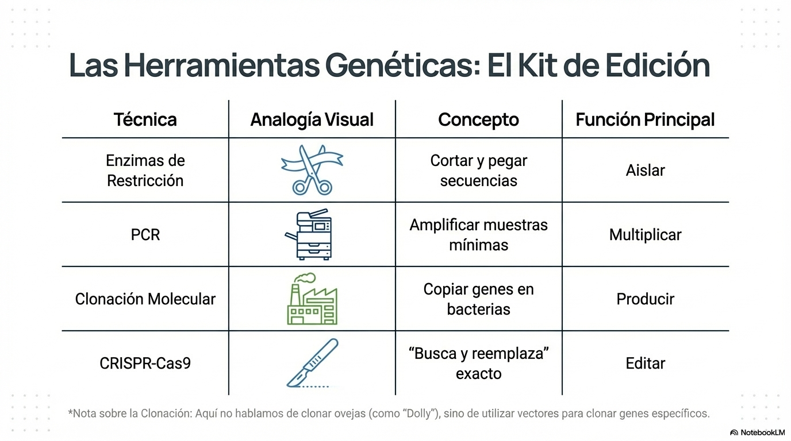
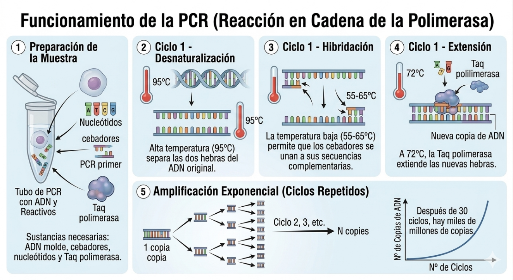
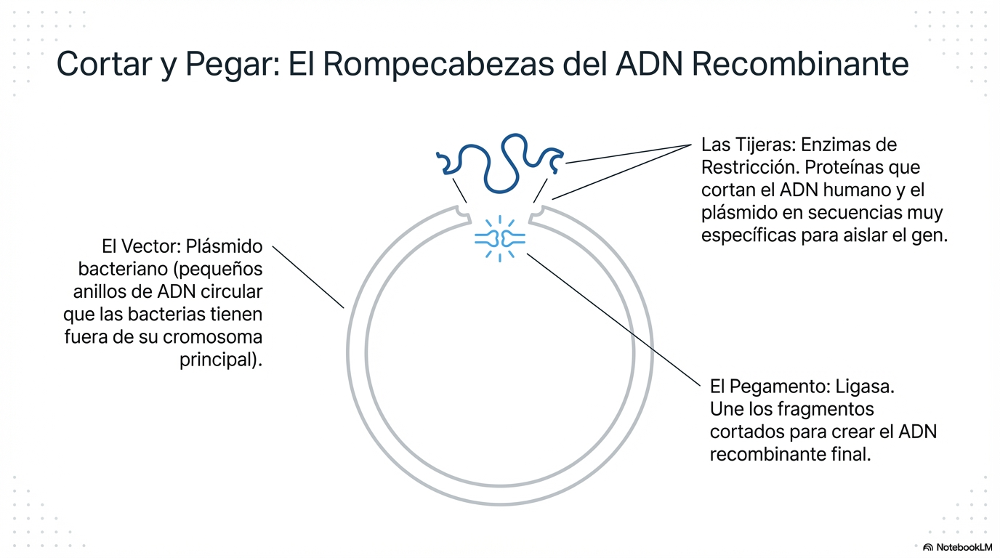
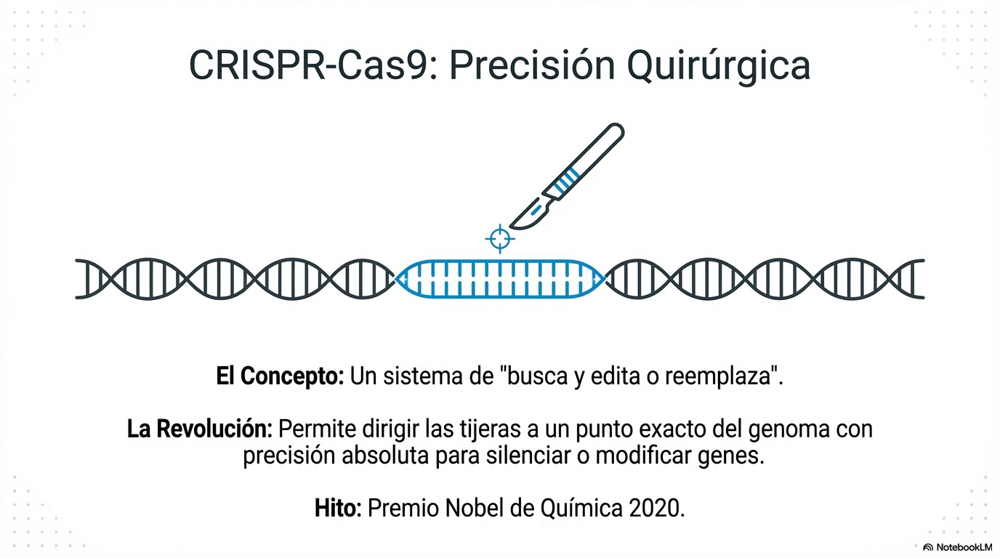
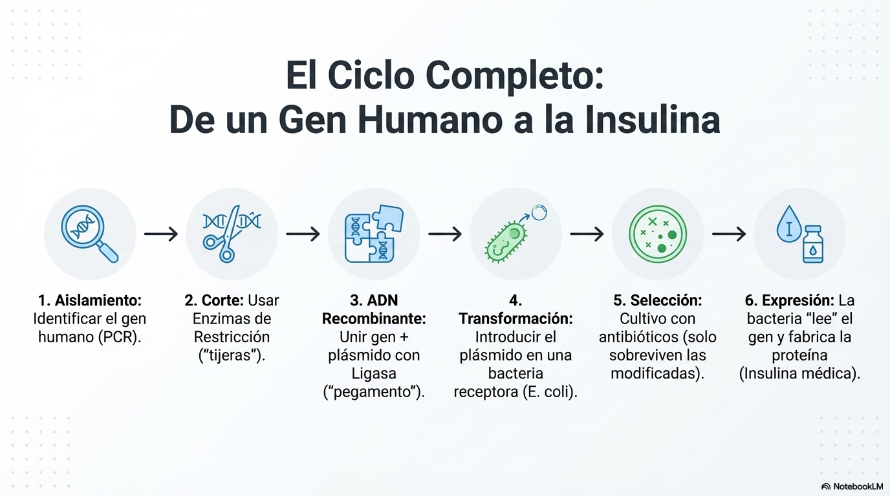
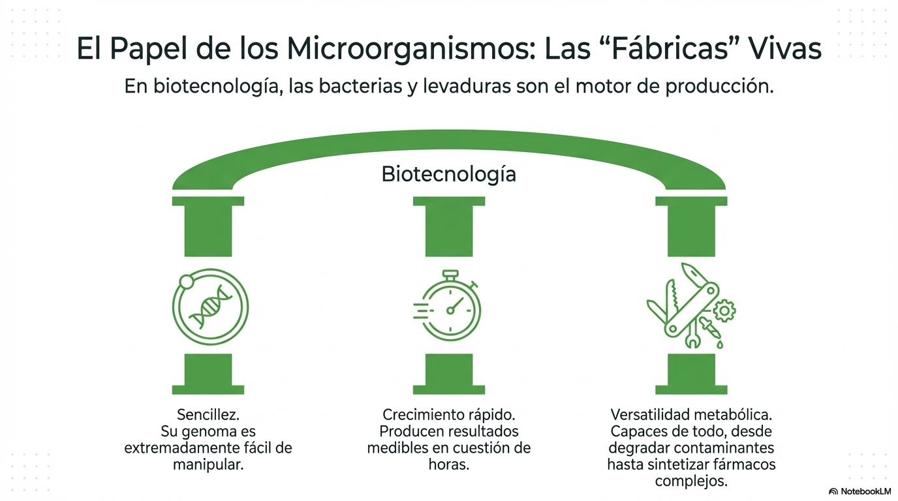
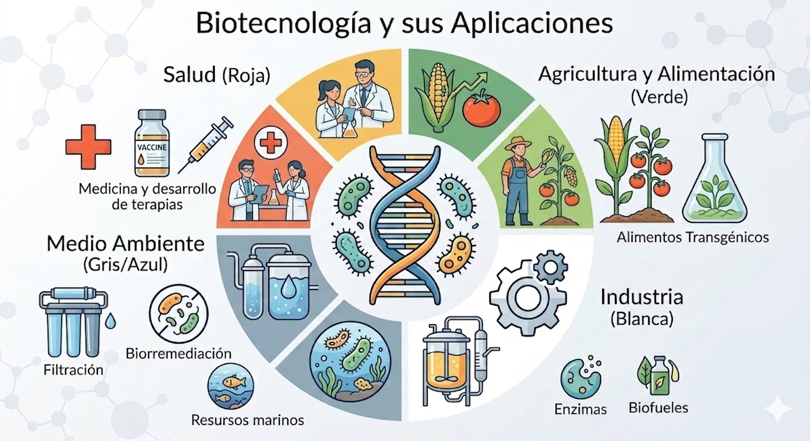
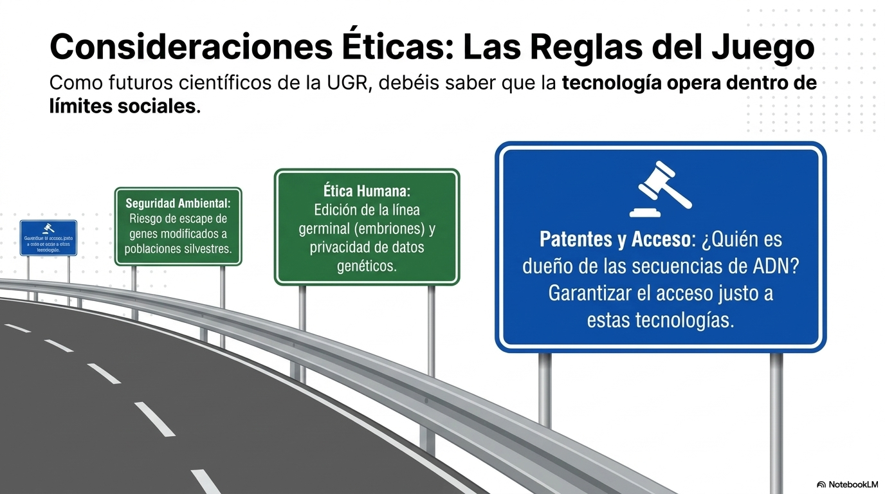

En el bloque de **Biotecnología**, no buscamos que seas un genetista molecular, pero sí que comprendas las herramientas que permiten \"editar\" la vida.

El objetivo de la biotecnología es **utilizar sistemas biológicos (células vivas o sus componentes, como enzimas) para generar servicios o productos útiles**. Esto tiene aún más interés en el contexto actual de crisis climática, pandemias y aumento demográfico ya que permite por ejemplo:

- **Desacoplar la producción de la contaminación:** Sustituyendo procesos químicos por biológicos.

- **Personalizar la ciencia:** Adaptando tratamientos médicos al ADN de cada individuo.

- **Optimizar cultivos en suelos degradados**.

La biotecnología no es una disciplina aislada, necesita de conocimientos de biología molecular, genética, ingeniería y química.

# 1. Técnicas de Ingeniería Genética

La ingeniería genética es el conjunto de técnicas que permiten manipular el ADN de un organismo para modificarlo o transferirlo a otro. Estas son las herramientas fundamentales:

::: {style="text-align:center;"}
{width="6.5in"}
:::

## A. Enzimas de Restricción e Ingeniería de Corte

Imagina que son \"tijeras moleculares\". Son proteínas que cortan el ADN en secuencias muy específicas.

- **Función:** Permiten aislar un gen de interés.

- **Ligasa:** Es el \"pegamento\" que une los fragmentos cortados para crear **ADN recombinante**.

## B. PCR (Reacción en Cadena de la Polimerasa)

Es una técnica de **fotocopiado molecular**.

- **Objetivo:** Obtener millones de copias de un fragmento de ADN a partir de una muestra mínima.

- **Fundamento:** Utiliza ciclos de temperatura para la desnaturalización del ADN y separación de las hebras (95ºC), la hibridación con cebadores(55-65ºC) y la extensión (72ºC) y una enzima resistente al calor (ADN polimerasa) para duplicar las hebras.

- **Uso:** Fundamental en estudios de biodiversidad, medicina forense y detección de patógenos.

::: {style="text-align:center;"}
{width="6.010416666666667in"}
:::

## C. Clonación Molecular

No hablamos de \"Dolly\", sino de clonar genes.

- **Proceso:** Se introduce un gen en un **vector** (normalmente un plásmido bacteriano).

- **Resultado:** La bacteria, al reproducirse, copia el gen y produce la proteína que este codifica (por ejemplo, la insulina humana).

Este proceso se basa en el uso de **vectores de clonación**, que normalmente son plásmidos (pequeños anillos de ADN circular que las bacterias tienen fuera de su cromosoma principal).

::: {style="text-align:center;"}
{width="4.694436789151356in"}
:::

## D. CRISPR-Cas9

Es la tecnología más revolucionaria (Premio Nobel 2020).

- **Concepto:** Un sistema de \"busca y edita o reemplaza\". Permite dirigir unas tijeras moleculares a un punto exacto del genoma con una precisión quirúrgica, como consecuencia se puede silenciar o modificar genes.

::: {style="text-align:center;"}
{width="5.425293088363954in"}
:::

# 2. Transformación genética

Las técnicas de ingeniería genética se pueden utilizar en transformación genética: incorporación de nuevos genes en los organismos. Esto es muy habitual en biotecnología. El procedimiento se resumiría en los siguientes pasos que emplean las herramientas anteriormente detalladas: 

1.  **Aislamiento del gen de interés:** Se identifica el fragmento de ADN que queremos clonar (por ejemplo, el gen de la insulina humana) y se amplifica por PCR.

2.  **Corte con enzimas de restricción:** Se utiliza la misma \"tijera molecular\" para cortar tanto el ADN humano como el plásmido bacteriano.

3.  **Formación del ADN Recombinante:** Se mezclan ambos ADN y se añade la enzima **ligasa**. Esta enzima actúa como un pegamento químico, uniendo el gen al plásmido.

4.  **Transformación (Transferencia):** El plásmido recombinante se introduce en una bacteria receptora (normalmente *E. coli*).

5.  **Selección y Proliferación:** Se cultivan las bacterias. Solo aquellas que han incorporado con éxito el plásmido sobrevivirán (normalmente usando antibióticos como filtro). Cada vez que la bacteria se divide, clona el gen de interés.

6.  **Expresión:** La bacteria \"lee\" el gen humano y empieza a fabricar la proteína (insulina), que luego se purifica para uso médico.

::: {style="text-align:center;"}
{width="6.5in"}
:::

# 3. El papel de los Microorganismos

Aunque en Biotecnología se pueden utilizar todo tipos de organismos, las bacterias y levaduras son las principales \"fábricas \". Su importancia radica en:

1.  **Sencillez:** Su genoma es fácil de manipular.

2.  **Crecimiento rápido:** Producen resultados en horas.

3.  **Versatilidad metabólica:** Pueden degradar contaminantes o sintetizar fármacos.  

::: {style="text-align:center;"}
{width="5.903421916010498in"}
:::

# 4. Aplicaciones y Repercusiones

La biotecnología se divide clásicamente por colores según su ámbito:

  -------------------- ---------------------- ----------------------------------------------------------------------------------------------------------
  **Ámbito**           **Denominación**       **Ejemplos Clave**

  **Salud**            Biotecnología Roja     Producción de vacunas, antibióticos, terapia génica y hormonas (insulina).

  **Agricultura**      Biotecnología Verde    Creación de **OGM** (Organismos Genéticamente Modificados) resistentes a plagas o sequías.

  **Medio Ambiente**   Biotecnología Gris     **Biorremediación**: uso de organismos para limpiar vertidos de petróleo o aguas residuales, metales....

  **Industria**        Biotecnología Blanca   Uso de enzimas en detergentes o producción de biocombustibles.
  -------------------- ---------------------- ----------------------------------------------------------------------------------------------------------

::: {style="text-align:center;"}
{width="6.5in"}
:::

## A. Biotecnología Roja (Salud y Medicina)

Es la rama más avanzada. Se centra en el diagnóstico, la prevención y el tratamiento de enfermedades.

- **Ejemplo: La Insulina Recombinante.**

  - **Antes:** Se obtenía de páncreas de cerdos y vacas (causaba alergias) y su producción era limitada.

  - **Proceso Biotecnológico:** Se aísla el gen humano de la insulina y se inserta en un plásmido de la bacteria *Escherichia coli*.

  - **Resultado:** La bacteria se convierte en una factoría que fabrica insulina exactamente igual a la humana, eliminando rechazos y garantizando un suministro masivo y ético, a un menor coste. 

## B. Biotecnología Verde (Agricultura y Alimentación)

Busca mejorar la productividad agrícola reduciendo el impacto ambiental.

- **Ejemplo: El Maíz Bt (Resistencia a plagas).**

  - **El problema:** Las larvas de taladro destruyen las cosechas, obligando a usar pesticidas químicos tóxicos.

  - **Solución:** Se inserta en el maíz un gen de la bacteria *Bacillus thuringiensis* (Bt) que es tóxica para la plaga..

  - **Resultado:** La planta sintetiza de forma natural una proteína tóxica para el insecto pero inocua para humanos. El agricultor deja de fumigar, protegiendo el suelo y la salud.

## C. Biotecnología Gris (Medio Ambiente)

Se enfoca en la protección y restauración de ecosistemas.

- **Ejemplo: Biorremediación de Hidrocarburos.**

  - **El proceso:** Tras un vertido de petróleo, se utilizan consorcios bacterianos (naturales o modificados) con alta capacidad metabólica.

  - **Acción:** Las bacterias utilizan el petróleo como fuente de carbono (comida), transformando las cadenas complejas y tóxicas de hidrocarburos en CO2 y agua, sustancias mucho menos dañinas.

## D. Biotecnología Blanca (Industrial y Nuevos Materiales)

Sustituye procesos industriales tradicionales por otros basados en sistemas vivos, más eficientes y limpios.

- **Ejemplo: Producción de Bioplásticos (PHAs).**

  - **El mecanismo:** Ciertas bacterias almacenan energía en forma de gránulos de **polihidroxialcanoatos** (PHA) cuando tienen un exceso de nutrientes.

  - **Aplicación:** Se extraen estos polímeros para fabricar **plásticos** que son **100% biodegradables** y que no dependen del petróleo, cerrando un ciclo de economía circular.

## E. Biotecnología Azul (Marina)

Explora la inmensa biodiversidad de los océanos para encontrar soluciones biológicas.

- **Ejemplo: Enzimas de organismos extremófilos.**

  - **Uso:** Se extraen enzimas de bacterias que viven en fuentes termales marinas a presiones y temperaturas extremas.

  - **Aplicación:** Estas enzimas (como la *Taq polimerasa* que usamos en la PCR) son capaces de resistir el calor, permitiendo realizar análisis de ADN que serían imposibles con enzimas normales.

# 5. Consideraciones Éticas (Bioética)

Como futuros científicos de la UGR, debéis saber que estas técnicas tienen límites. El currículo LOMLOE destaca:

- **Seguridad ambiental:** El riesgo de escape de genes modificados a poblaciones silvestres.

- **Ética humana:** La edición de la línea germinal (embriones) y la privacidad de los datos genéticos.

- **Patentes:** Quién es dueño de las secuencias de ADN y el acceso justo a estas tecnologías.

::: {style="text-align:center;"}
{width="6.5in"}
:::
