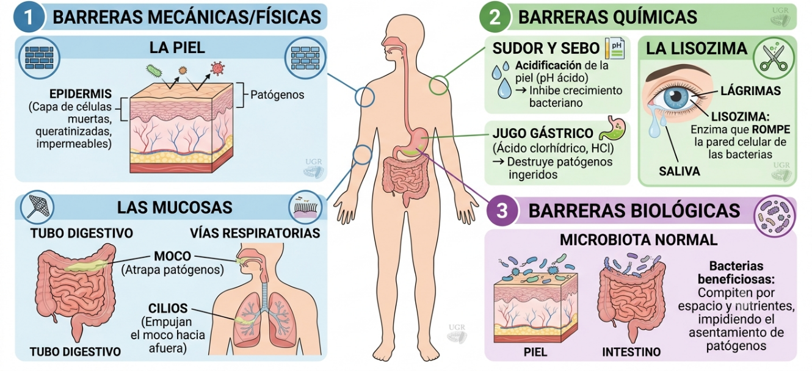
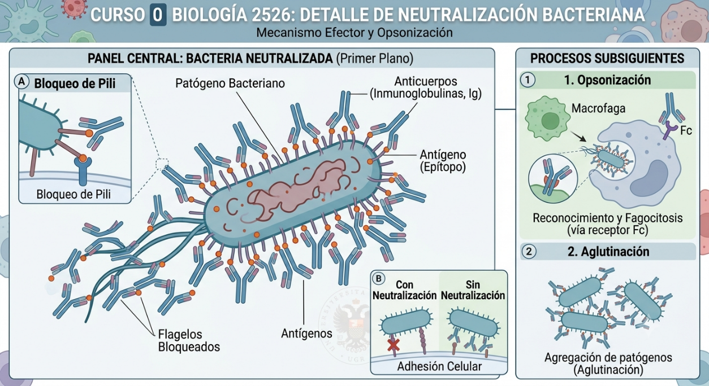
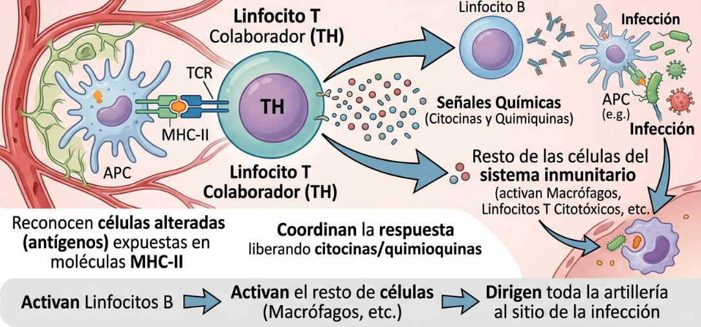

# 1. Concepto de Inmunidad

La **inmunidad** es la capacidad global que tiene un organismo pluricelular para resistir y defenderse de la agresión de agentes extraños (patógenos como virus, bacterias, hongos o parásitos) o de células propias alteradas (como las tumorales), manteniendo así la homeostasis y la integridad estructural del cuerpo.

Un **antígeno** se define como cualquier molécula capaz de activar una respuesta inmunitaria. Usualmente los antígenos se encuentran en la superficie de los patógenos.

# 2. Las Barreras Externas: La Primera Línea de Defensa

Antes de que el sistema inmunitario mueva un solo \"soldado\", el cuerpo cuenta con barreras anatómicas y químicas que impiden o dificultan físicamente la entrada de los patógenos. Son inespecíficas (actúan igual contra cualquier invasor; @fig-barreras).

- **Barreras Mecánicas/Físicas:** La **piel** (una capa de células muertas queratinizadas e impermeables) y las **mucosas** (que recubren el tubo digestivo, vías respiratorias y urogenitales, atrapando patógenos mediante el moco).

- **Barreras Químicas:** Sustancias que destruyen patógenos o impiden su crecimiento.

  - El **sudor** y el **sebo**, que acidifican la piel.

  - El **jugo gástrico** del estómago (su ácido clorhídrico destruye casi todo lo ingerido).

  - La **lisozima**: Una enzima presente en la saliva y, de vital importancia para los estudiantes de Óptica, en las **lágrimas**, capaz de romper la pared celular de las bacterias.

- **Barreras Biológicas:** La **microbiota normal** (bacterias beneficiosas de nuestra piel e intestino) que compiten por el espacio y los nutrientes, impidiendo que los patógenos se asienten.

::: {style="text-align:center;"}
{width="7.46652668416448in" #fig-barreras}
:::

# 3. Inmunidad Innata (inespecífica) e Inmunidad Específica (Adaptativa o Adquirida)

Si un patógeno burla las barreras externas (por ejemplo, a través de una herida), existen dos estrategias inmunitarias cooperativas. Son dos estrategias defensivas interconectadas pero con filosofías radicalmente distintas: la **inmunidad innata** y la **inmunidad específica** (o adaptativa).

- La **inmunidad innata** es nuestra primera línea de defensa: es **inespecífica** (ataca de la misma manera a cualquier elemento extraño, ya sea una bacteria o una astilla), es **innata** (nacemos con ella) y su respuesta es **inmediata**, empleando barreras físicas (como la piel), componentes químicos y células devoradoras (fagocitos). Sin embargo, no guarda recuerdo del enemigo.

- Por el contrario, la **inmunidad específica** es la \"fuerza de élite\" del organismo: se activa solo cuando la innata se ve desbordada, es **altamente selectiva** (diseña una respuesta exclusiva contra un patógeno concreto mediante linfocitos B y T) y, aunque tarda unos días en activarse la primera vez, posee **memoria inmunológica para futuros encuentros con el mismo antígeno**. Esta memoria es la que nos hace responder de forma más rápida y eficaz a futuras infecciones del mismo patógeno impidiendo el desarrollo de la enfermedad y es la base científica de las vacunas.

  -------------------------------------------------------------------------------------------------------------------------------------------------------------------------------------------------------------------------------
  **Característica**                 **Inmunidad Innata (Inespecífica)**                                                   **Inmunidad Específica (Adaptativa)**
  ---------------------------------- ------------------------------------------------------------------------------------- ------------------------------------------------------------------------------------------------------
  **¿**Cuándo **aparece?**           Desde el nacimiento.                                                                  Se desarrolla tras exponerse al patógeno.

  **¿**Cuánto **tarda en actuar?**   Inmediato (minutos u horas).                                                          Tardía (varios días en el primer contacto).

  **Especificidad**                  Baja (reconoce patrones genéricos de peligro frente a la mayoría de los patógenos).   Alta (reconoce antígenos muy concretos). Solo se activa frente a patógenos específicos

  **Componentes clave**              Piel, mucosas, inflamación, fagocitos.                                                Linfocitos B (anticuerpos) y Linfocitos T.

  **Memoria**                        **No** tiene. Si vuelve el patógeno reacciona de forma similar                        **Sí** tiene. Si vuelve ese patógeno se activa de nuevo evitando que vuelvas a enfermar de lo mismo.
  -------------------------------------------------------------------------------------------------------------------------------------------------------------------------------------------------------------------------------

# 4. Inmunidad Humoral y Celular: Mecanismos de Acción

Dentro de la inmunidad específica o adquirida, los encargados de la defensa son los linfocitos, que actúan mediante dos mecanismos distintos según dónde se esconda el enemigo:

## A. Inmunidad Humoral (Dirigida contra patógenos extracelulares)

- **Protagonistas:** unos glóbulos blancos especializados (**linfocitos B)**.

- **Mecanismo:** Cuando un linfocito B reconoce su antígeno específico (p. ej. una proteína de la cubierta de un patógeno), se activa y se divide masivamente, madurando y originando **células plasmáticas**. Estas células se van a dedicar a fabricar unas proteínas llamadas inmunoglobulinas o **anticuerpos**, proteínas que se liberan a la sangre y los fluidos (\"humores\") corporales. Una vez allí, reconocen la proteína del patógeno y se unen a ella, marcándola para su posterior eliminación.

- **Acción de los anticuerpos:** No destruyen al patógeno directamente, sino que lo inutilizan mediante varios mecanismos (@fig-anticuerpos):

  - *Neutralización:* Bloquean al patógeno, inutilizando su superficie, para frenar su ataque, impidiendo que sigan infectando células o dañando tejidos.

  - *Opsonización:* Al unirse, \"marcan\" al patógeno para que los fagocitos se lo "coman" más fácilmente.

  - *Aglutinación:* Los patógenos opsonizados tienden a aglutinarse, facilitando de esta manera su reconocimiento y eliminación por los diferentes componentes del sistema inmunitario

::: {style="text-align:center;"}
{width="7.622035214348206in" #fig-anticuerpos}
:::

## B. Inmunidad Celular (Dirigida contra patógenos intracelulares o células defectuosas)

- **Protagonistas:** otros tipos de glóbulos blancos. Los **Linfocitos T**.

- **Mecanismo:** Estas células no producen anticuerpos. Actúan directamente célula a célula, reconociendo células alteradas como las infectadas con virus o bacterias intracelulares o células cancerosas.

- **Tipos principales:**

  - *Linfocitos T Citotóxicos (T~C~):* Destruyen por contacto directo a las células infectadas o tumorales reconociéndolas y secretando diferentes moléculas, las cuales inducen su suicidio celular (apoptosis).

  - *Linfocitos T Colaboradores / Helpers (T~H~):* Son los \"generales\" del sistema inmunitario; reconocen las células alteradas por reconocimiento de móleculas expuestas en las mismas y coordinan la respuesta liberando señales químicas (citocinas y quimioquinas) que activan tanto a los linfocitos B como al resto de las células del sistema inmunitario, dirigiendo toda la artillería al sitio donde se ha producido la infección (@fig-linfocitos).

::: {style="text-align:center;"}
{width="7.875166229221347in" #fig-linfocitos}
:::

# 5. Clasificación de la Inmunidad Adquirida

Si consideramos la inmunidad específica o adquirida, esta se puede desarrollar en un organismo de diferentes maneras, según dos aspectos a considerar. Si atendemos a la forma de obtener las defensas, hablamos de inmunidad **Activa** o **Pasiva**, y si atendemos a la intención, podemos hablar de inmunidad **Natural** o **Artificial**.

- **Activa:** El propio organismo fabrica sus anticuerpos y genera memoria (tarda días en ser efectiva, pero dura años o toda la vida).

- **Pasiva:** El organismo recibe anticuerpos ya fabricados por otro ser vivo (efecto inmediato, pero temporal, no genera memoria).

- **Natural:** La producción de anticuerpos es biológica.

- **Artificial:** La producción de anticuerpos es artificial.

En la siguiente tabla se pueden apreciar los cuatro mecanismos

  ------------ ------------------------------------------------------------------------------------------------------------------------------------------------------ -------------------------------------------------------------------------------------------------------------------------------------------
               **NATURAL (Procesos biológicos espontáneos)**                                                                                                          **ARTIFICIAL (Intervención médica/tecnológica)**

    **ACTIVA** **Sufrir la enfermedad:** Pasas la infección, tu cuerpo lucha y genera linfocitos de memoria.                                                          **Vacunación:** Se introduce el patógeno atenuado o muerto (o sus antígenos). No causa enfermedad, pero el cuerpo genera memoria.

    **PASIVA** **Vía transplacentaria o lactancia:** La madre pasa anticuerpos al feto a través de la placenta o la leche materna (calostro) para proteger al bebé.   **Sueroterapia:** Inyección directa de suero con anticuerpos preformados (ej. suero antiofídico contra picaduras de escorpión o tétanos).
  ------------ ------------------------------------------------------------------------------------------------------------------------------------------------------ -------------------------------------------------------------------------------------------------------------------------------------------

# 6. Enfermedades Infecciosas: Fases

Una infección es la colonización de un organismo por parte de un patógeno externo. Aunque las infecciones y enfermedades pueden ser muy variables, podemos decir que de manera general, toda enfermedad infecciosa atraviesa cuatro fases cronológicas:

1.  **Fase de Incubación:** Tiempo comprendido entre la entrada del patógeno y la aparición de los primeros síntomas. El patógeno se está multiplicando activamente pero aún no causa daño suficiente. El individuo puede ser contagioso sin saberlo.

2.  **Fase Prodrómica:** Aparecen síntomas generales e inespecíficos (malestar general, cansancio, febrícula). Son las señales de que el sistema inmunitario innato ha empezado a combatir.

3.  **Fase de Período Clínico (o de Estado):** Aparecen los síntomas específicos de la enfermedad (ej. manchas de la varicela, dificultad respiratoria). Es el pico de la infección. El sistema inmunitario específico está luchando al máximo.

4.  **Fase de Convalecencia:** El patógeno ha sido eliminado o controlado. El organismo repara los daños celulares ocasionados y recupera poco a poco las fuerzas.

# 7. Principales Patologías del Sistema Inmunitario

A veces, el sistema inmunitario comete errores de cálculo. Clínicamente, clasificamos sus fallos en tres grandes grupos:

## A. Hipersensibilidad (Alergias)

- **Causa:** Una respuesta inmunitaria desproporcionada y exagerada ante sustancias que en realidad son inocuas (polen, ácaros, alimentos, componentes de soluciones para lentes de contacto), denominadas **alérgenos**.

- **Relevancia clínica:** Está mediada por un anticuerpo específico, la **Inmunoglobulina E (IgE)**, que provoca la liberación masiva de **histamina** por parte de unas células llamadas mastocitos. Provoca inflamación, rinitis, conjuntivitis alérgica (ojo rojo y picor) y, en casos graves, shock anafiláctico. Por eso tomamos antihistamínicos cuando estamos con alergias.

## B. Autoinmunidad

- **Causa:** El sistema inmunitario pierde la capacidad de distinguir lo propio de lo ajeno y **ataca a los tejidos sanos del propio organismo**. Los linfocitos interpretan las células propias del cuerpo como si fueran patógenos.

- **Relevancia clínica:** Produce enfermedades crónicas graves y degenerativas como la Artritis Reumatoide, el Lupus Eritematoso Sistémico (LES), la Esclerosis Múltiple o la Diabetes Tipo I.

## C. Inmunodeficiencias

- **Causa:** Incapacidad del sistema inmunitario para responder eficazmente, dejando al organismo desprotegido ante cualquier infección. Puede ser **congénita** (de nacimiento, de origen genético) o **adquirida** (factores externos a lo largo de la vida).

- **Relevancia clínica:** El ejemplo más célebre es el Síndrome de Inmunodeficiencia Adquirida (**SIDA)**, causado por el virus del **VIH**, que destruye específicamente a los Linfocitos T Colaboradores (*T~H~*). Sin generales que den órdenes, los soldados (*T~c~*) y las fábricas de armas (Linfocitos B) se quedan parados. El cuerpo entra en inmunodeficiencia y cualquier infección leve puede ser fatal. El paciente queda indefenso ante \"infecciones oportunistas\" (microbios comunes que no harían daño a una persona sana, pero que en ellos resultan mortales).
