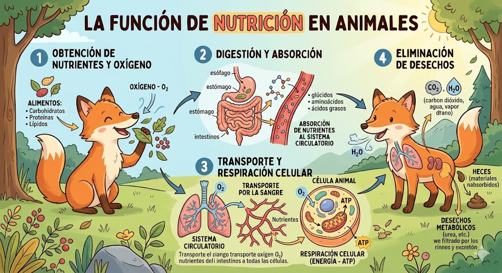
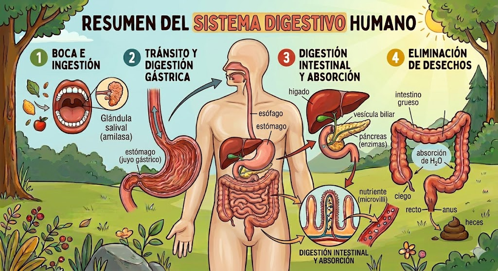
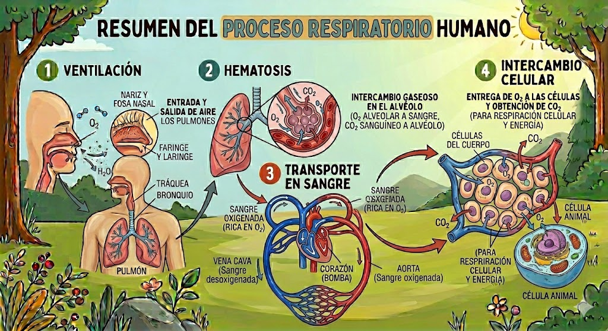
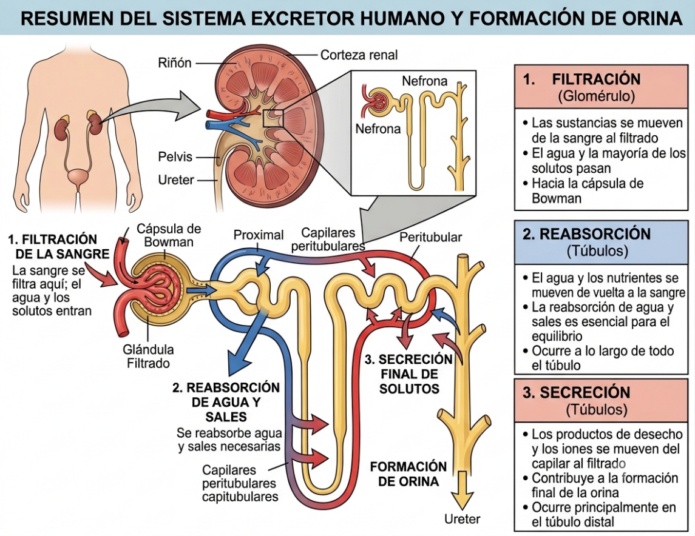
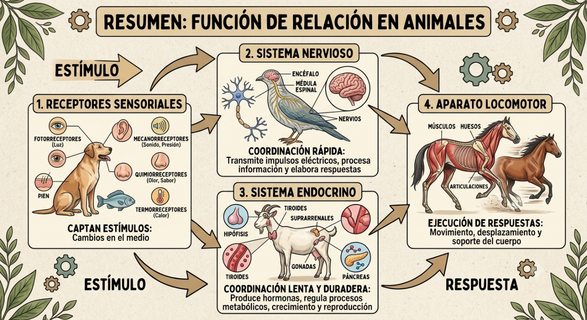
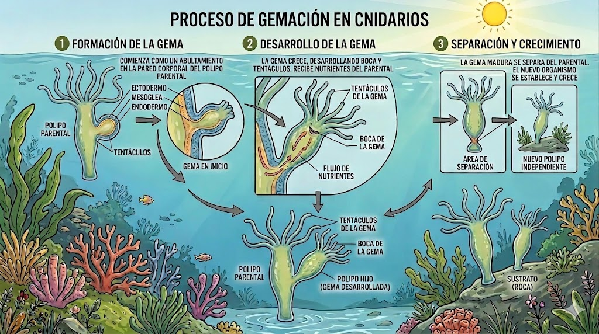
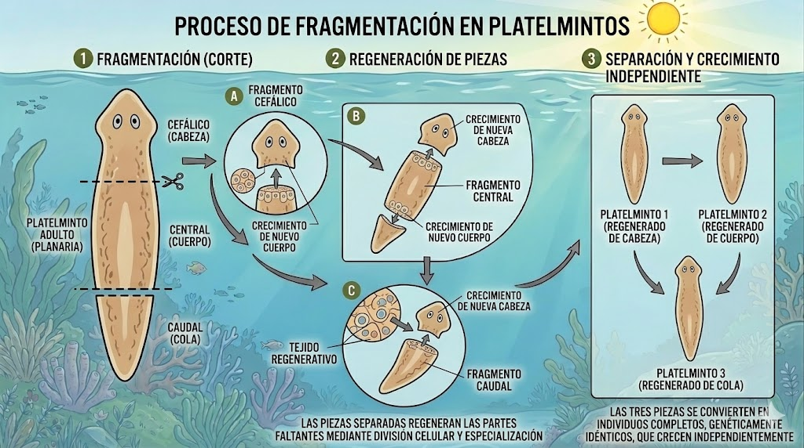
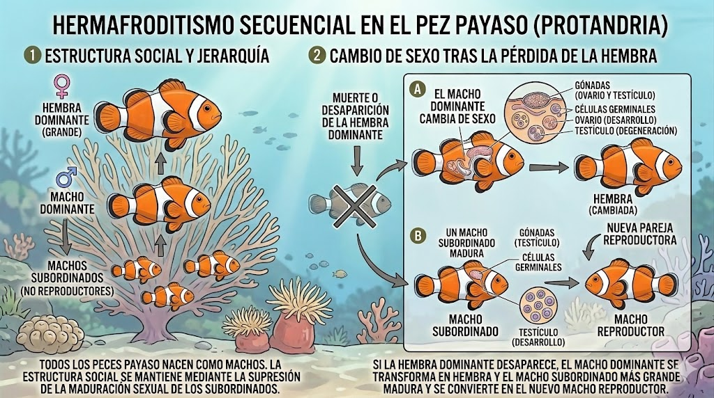
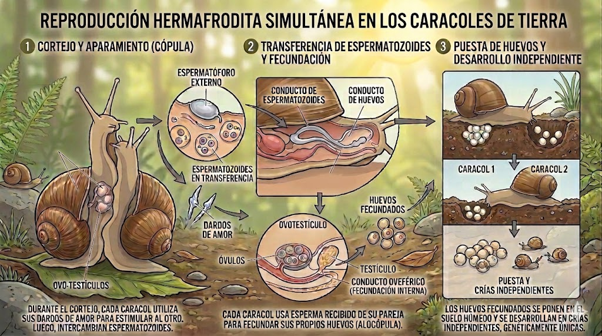
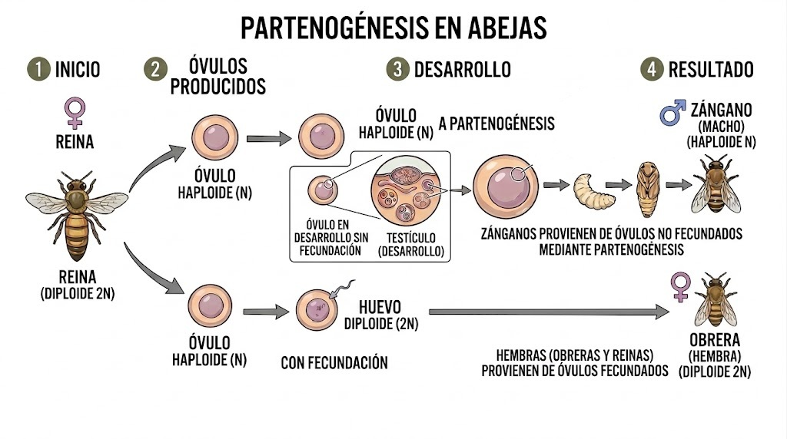

# La función de nutrición: importancia biológica y estructuras implicadas en diferentes grupos taxonómicos. {#nutricion}

Se trata del proceso de obtención, transformación y utilización de los nutrientes y la energía necesarios para el desarrollo y mantenimiento de los animales.

::: {style="text-align:center;"}
{width="6.225in" height="3.3982174103237095in"}
:::

En esta función participan cuatro sistemas principales:

1.  [Sistema digestivo]{.underline}: es el encargado de recibir, transformar y utilizar las sustancias químicas (nutrientes) contenidas en los alimentos. Se incluyen procesos como la masticación, deglución, [digestión](https://es.wikipedia.org/wiki/Digesti%C3%B3n), [absorción](https://es.wikipedia.org/wiki/Absorci%C3%B3n_de_nutrientes) y eliminación de los desechos no aprovechables. A grandes rasgos, la digestión consiste en la fragmentación del alimento en unidades más pequeñas, lo que puede conseguirse mediante la secreción de sustancias químicas o por acción mecánica. Por su parte, la absorción es el paso de los nutrientes del tubo digestivo a la sangre. El bolo alimenticio va desplazándose por el digestivo gracias a la movilidad que presenta. A lo largo de la evolución, el sistema digestivo ha ido volviéndose más complejo, desarrollando partes especializadas y [glándulas anejas](https://es.wikipedia.org/wiki/Gl%C3%A1ndulas_anexas) secretoras de sustancias digestivas.

::: {style="text-align:center;"}
{width="5.9in" height="3.216666666666667in"}
:::

2.  [Sistema respiratorio]{.underline}: cumple el papel fundamental de captar oxígeno del medio ambiente y eliminar el dióxido de carbono, gases imprescindibles para la respiración celular animal. El principio físico para que pueda producirse este intercambio de gases es la diferencia de presión, de forma que los gases suelen difundir desde donde hay mayor presión hacia donde hay menos. En general, la respiración incluye los procesos de [ventilación](https://es.wikipedia.org/wiki/Ventilaci%C3%B3n_pulmonar), [hematosis](https://es.wikipedia.org/wiki/Hematosis), transporte en sangre e intercambio celular. En el reino animal existen cuatro tipos de [sistemas respiratorios](https://es.wikipedia.org/wiki/Respiraci%C3%B3n) especializados: piel, branquias, tráqueas y pulmones.

::: {style="text-align:center;"}
{width="5.9in" height="3.216666666666667in"}
:::

3.  [Sistema circulatorio]{.underline}: en buena parte de los animales se ha desarrollado un sistema de transporte de sustancias (principalmente nutrientes, productos de desecho, gases, hormonas e iones) que permite la comunicación entre todas las células del organismo. Este sistema suele constar de una bomba impulsora (corazón), un circuito formado por vasos en los que se transporta el líquido circulatorio y válvulas que ayudan a regular el paso de este líquido (para que ocurra en una sola dirección). A nivel evolutivo, además, ha facilitado la colonización de ambientes con condiciones cambiantes, gracias a que el líquido circulatorio permite mantener las condiciones del medio interno constantes ([homeostasis](https://es.wikipedia.org/wiki/Homeostasis)).

4.  [Sistema excretor]{.underline}: se encarga de eliminar (de forma acuosa) sustancias presentes en la sangre que pueden ser tóxicas, principalmente residuos metabólicos nitrogenados (amonio, urea o ácido úrico). La excreción incluye los procesos de filtración de la sangre, reabsorción de agua y solutos y secreción final de solutos. En el reino animal, existe una gran variedad de órganos con función excretora, destacando los [nefridios](https://es.wikipedia.org/wiki/Nefridio), los [túbulos de Malpigio](https://es.wikipedia.org/wiki/Tubos_de_Malpighi) y los [riñones](https://es.wikipedia.org/wiki/Ri%C3%B1%C3%B3n).

::: {style="text-align:center;"}
{width="5.183333333333334in" height="3.998989501312336in"}
:::

# La función de relación: fisiología y funcionamiento de los sistemas de coordinación (nervioso y endocrino), de los receptores sensoriales, y de los órganos efectores. {#relacion}

Esta función permite la percepción de estímulos exteriores e interiores, el procesamiento de dicha información y la elaboración de respuestas que resulten beneficiosas para el organismo. Estos procesos pueden llevarse a cabo gracias a la coordinación de los siguientes sistemas:

::: {style="text-align:center;"}
{width="5.9in" height="3.216666666666667in"}
:::

1.  [Receptores sensoriales](https://es.wikipedia.org/wiki/Receptor_sensorial) (mecanorreceptores, quimiorreceptores, termorreceptores y fotorreceptores) y los órganos de los sentidos: encargados de captar información e informar al sistema nervioso.

2.  [Sistema nervioso]{.underline}: formado por [neuronas](https://es.wikipedia.org/wiki/Neurona) (encargadas de la recepción, integración y transmisión de la información) y [células de la glía](https://es.wikipedia.org/wiki/C%C3%A9lula_glial) (función auxiliar). A grandes rasgos, el sistema nervioso puede dividirse en: sistema nervioso central (incluye el encéfalo y la médula espinal) y sistema nervioso periférico (comunica el central con el resto del cuerpo). Por otro lado, una parte se encarga de realizar acciones voluntarias (sistema nervioso somático) y otra de acciones automáticas o involuntarias (sistema nervioso autónomo).

3.  [Sistema endocrino]{.underline}: consiste en el conjunto de órganos y glándulas que secretan unas sustancias, llamadas [hormonas](https://es.wikipedia.org/wiki/Hormona), que viajan por la sangre y cumplen diversas funciones de regulación sobre distintas funciones corporales (crecimiento, metabolismo y desarrollo sexual entre otros). Se trata de un sistema muy complejo porque varias hormonas pueden interactuar entre sí y producir efectos contrarios, por lo que una alteración en sus niveles, aunque sea pequeña, puede tener graves consecuencias para el organismo.

4.  [Aparato locomotor]{.underline}: formado por esqueleto y músculos. La naturaleza del [sistema esquelético](https://es.wikipedia.org/wiki/Esqueleto) varía a lo largo del reino animal, pudiendo existir esqueletos hidráulicos (por movimiento de los fluidos internos del animal), esqueletos externos (partes endurecidas recubren el cuerpo blando del animal) y esqueletos internos (partes endurecidas en la parte interna del cuerpo). Por su parte, el [sistema muscular](https://es.wikipedia.org/wiki/Sistema_muscular) es el conjunto de músculos de un organismo y cuya función es la movilidad. Unos músculos son voluntarios (controlables conscientemente por el individuo) y otros funcionan de forma automática (como el [músculo cardíaco](https://es.wikipedia.org/wiki/Miocardio) y la [musculatura lisa](https://es.wikipedia.org/wiki/M%C3%BAsculo_liso)).

# La función de reproducción: importancia biológica, tipos y estructuras implicadas en diferentes grupos taxonómicos. {#reproduccion}

Una de las características fundamentales de los seres vivos es la capacidad de reproducirse, de generar nuevos seres vivos con características similares a ellos mismos.

En el reino animal, se dan tres tipos de reproducción:

1.  [Asexual]{.underline}: Un individuo puede replicarse a sí mismo produciendo individuos idénticos al original. Como modalidades principales encontramos la gemación (división a partir de una yema del progenitor, típico de algunos cnidarios) y la fragmentación (generación de individuos a partir de fragmentos corporales, como ocurre en las estrellas de mar, algunos [cnidarios](https://es.wikipedia.org/wiki/Cnidaria) y [platelmintos](https://es.wikipedia.org/wiki/Platyhelminthes)).

::: {style="text-align:center;"}
{width="5.9in" height="3.2916666666666665in"}
:::

::: {style="text-align:center;"}
{width="5.9in" height="3.2916666666666665in"}
:::

2.  [Sexual]{.underline}: En la gran mayoría de animales, los individuos producen unas células reproductivas por meiosis denominadas [gametos](https://es.wikipedia.org/wiki/Gameto) (contienen la mitad del material genético del organismo), que deben combinarse con las células reproductivas de otro individuo. Los gametos son los óvulos y los espermatozoides. En las especies monoicas, las hembras producen óvulos y los machos espermatozoides. En las especies dioicas, cada individuo puede producir ambos tipos de gametos, pero suelen necesitar a otro individuo para realizar la fecundación (por ejemplo, el pez payaso y los caracoles son hermafroditas, el primero cambia de sexo a lo largo de su vida y el segundo permanentemente produce ambos tipos de gametos).

::: {style="text-align:center;"}
{width="5.9in" height="3.2916666666666665in"}
:::
::: {style="text-align:center;"}
{width="5.9in" height="3.2916666666666665in"}
:::

Por su parte, la fecundación puede ser externa (liberando los gametos al medio) o interna (dentro del cuerpo de la hembra). En este último caso, los machos suelen presentar estructuras que ayudan a transferir sus espermatozoides al interior de la hembra: órganos copuladores (pene o cirro), [brazo hectocótilo](https://es.wikipedia.org/wiki/Hectocotylus) (en pulpos), [espermatóforos](https://es.wikipedia.org/wiki/Espermat%C3%B3foro) (arácnidos, insectos, algunos vertebrados), etc.

3.  [Partenogénesis]{.underline}: Se produce cuando las hembras pueden dar lugar a descendencia fértil a partir de un óvulo sin fecundar. Estos óvulos pueden ser, según la especie, [diploides](https://es.wikipedia.org/wiki/C%C3%A9lula_diploide) (producidos por [mitosis](https://es.wikipedia.org/wiki/Mitosis)) o [haploides](https://es.wikipedia.org/wiki/Haploid%C3%ADa) (producidos por [meiosis](https://es.wikipedia.org/wiki/Meiosis)). Hay ejemplos de partenogénesis en muchos grupos animales, como los [rotíferos](https://es.wikipedia.org/wiki/Rotifera), insectos, caracoles, reptiles, aves y mamíferos.

::: {style="text-align:center;"}
{width="5.908333333333333in" height="3.3in"}
:::