::: {style="text-align:center;"}
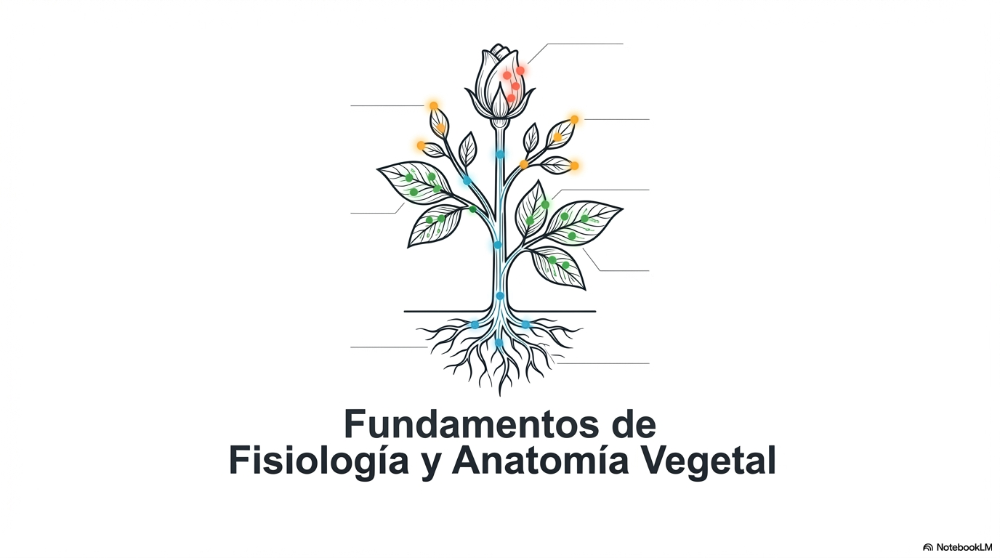{width="6.199154636920385in"}
:::

El reino de las plantas, formado por organismos pluricelulares y autótrofos, no es un grupo estático, presenta una complejidad asombrosa que sostiene la vida en nuestro planeta. Al carecer de movilidad propia, las plantas han evolucionado mediante estrategias de adaptación únicas, optimizando la captura de energía solar y la gestión de recursos hídricos en entornos muy diversos. Este bloque te proporcionará una visión integral, desde el funcionamiento celular en la **fotosíntesis** hasta la sofisticada red de transporte de **savia** que recorre sus tejidos conductores. Analizaremos también cómo las **fitohormonas** actúan como \"mensajeros químicos\" para responder a estímulos ambientales y cómo sus complejos **ciclos reproductivos** garantizan la variabilidad genética. Comprender estos mecanismos no es solo teoría biológica; es la base necesaria para abordar con éxito estudios sobre impacto ambiental o la gestión de ecosistemas naturales.

::: {style="text-align:center;"}
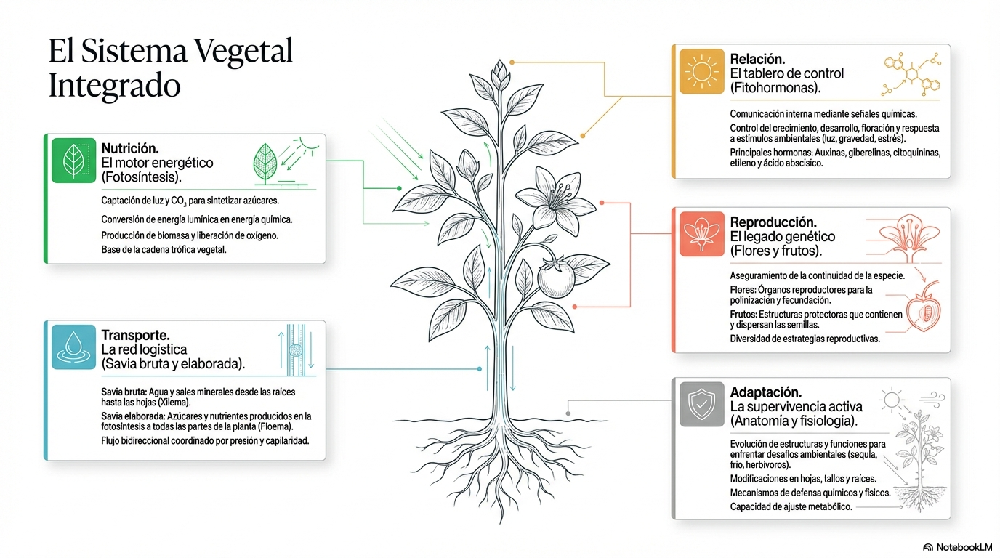{width="6.270138888888889in"}
:::

# 1. Función de Nutrición: La Fotosíntesis y Los Sistemas de Transporte

**La fotosíntesis** es el proceso mediante el cual los organismos autótrofos convierten la **energía luminosa en energía química**.

Es esencial para la vida porque:

- **Genera el oxígeno de la atmósfera** (21%) permitiendo la respiración oxigénica de los seres vivos.

- **Genera prácticamente toda la materia orgánica y la energía** que fluye a través de los ecosistemas.

- **Regula el Clima:** Al absorber CO2 (un gas de efecto invernadero), la fotosíntesis juega un papel fundamental en el ciclo del carbono y la regulación de la temperatura global.

- **Genera Recursos Energéticos:** Los combustibles fósiles (carbón, petróleo, gas natural) son restos de fotosíntesis antigua almacenada durante millones de años.

::: {style="text-align:center;"}
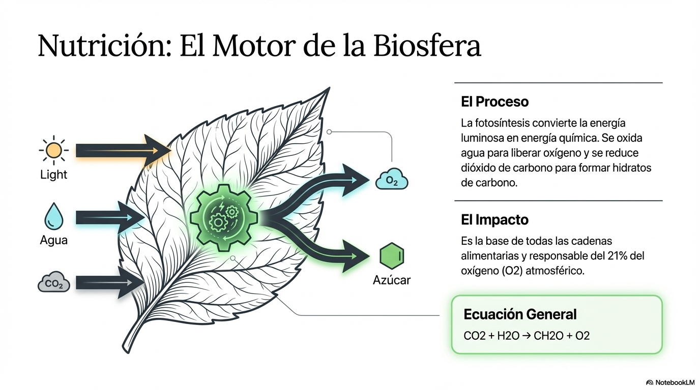{width="6.032550306211723in"}
:::

Este proceso no ocurre en un solo paso; se divide en dos fases distintas pero interconectadas que tienen lugar en diferentes partes del **cloroplasto**:

- **[Fase Fotoquímica (Luminosa):]{.underline}** Ocurre en los **tilacoides** del cloroplasto (los sacos aplanados dentro del cloroplasto). Es aquí donde se encuentran los pigmentos fotosintéticos (clorofilas, carotenoides) organizados en fotosistemas que absorben la luz.

   **Proceso Clave:** La luz excita a los pigmentos, lanzando electrones a través de una cadena de transporte (similar a la respiración celular).

   **Los 3 Hitos de la Fase Lumínica:**

     - **Fotólisis del Agua:** La energía de la luz rompe una molécula de agua (H2O), liberando electrones para reponer los perdidos por los pigmentos, protones (H+) y, **oxígeno molecular (O~2~)**, que es expulsado a la atmósfera como \"desecho\".

     - **Fotofosforilación (Síntesis de ATP):** La energía liberada en la cadena de electrones se usa para bombear protones y crear un gradiente electroquímico. Al pasar los protones a través de la enzima ATP sintasa, se fabrica **ATP**.

     - **Reducción de NADP+ a NADPH:** El aceptor final de electrones es el NADP+, que se convierte en **NADPH** (Poder Reductor).

   **En resumen:** La fase lumínica produce **ATP, NADPH y O₂**. Los dos primeros son la \"moneda energética\" y el \"poder reductor\" necesarios para la siguiente fase.

- **[Fase Bioquímica (Ciclo de Calvin):]{.underline}** Ocurre en el **estroma** (el espacio fluido que rodea a los tilacoides), se utiliza el ATP y el NADPH para fijar el CO2 y sintetizar azúcares gracias al ciclo de Calvin.

   **Proceso clave:** Se utiliza la energía y el poder reductor para fabricar azúcares.

   **Los 3 Pasos del Ciclo de Calvin:**

     - **Fijación del Carbono:** La enzima clave, **RuBisCO** (quizás la proteína más abundante de la Tierra), une una molécula de CO~2~ a una de 5 carbonos (Ribulosa 1,5-bisfosfato).

     - **Reducción:** Se usan el ATP (energía) y el NADPH (electrones) de la fase lumínica para \"reducir\" el carbono y fabricar moléculas de G3P (un precursor de la glucosa).

     - **Regeneración:** La mayor parte del G3P se usa para regenerar la molécula original de 5 carbonos para que el ciclo continúe. El resto se extrae del ciclo para sintetizar glucosa y otros compuestos orgánicos.

     **En resumen:** El ciclo de Calvin toma **ATP y NADPH** y \"fija\" el **CO₂** para producir **azúcares**.

::: {style="text-align:center;"}
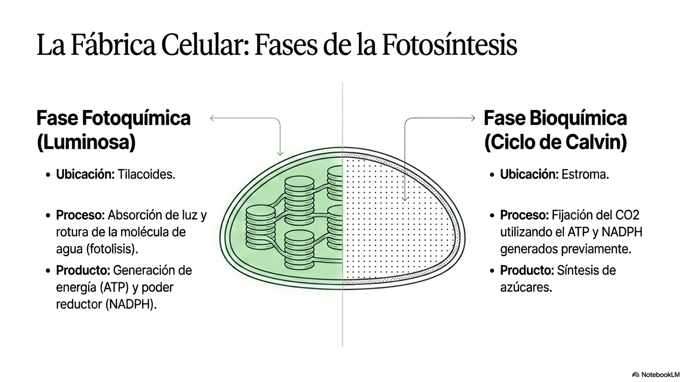{width="5.954823928258968in"}
:::

##  **Savia Bruta y Savia Elaborada: Transporte**

Para entender la función de nutrición es necesario conocer como la planta toma el agua y los nutrientes que constituyen la savia bruta y como se transportan los fotoasimilados (compuestos obtenidos gracias a la fotosíntesis) que conforman la savia elaborada al resto de la planta.

::: {style="text-align:center;"}
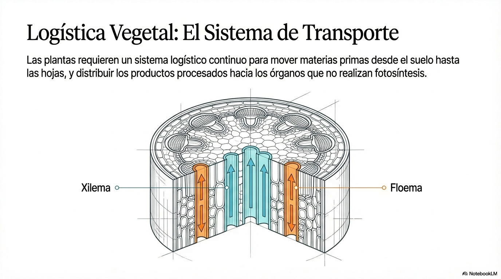{width="6.270138888888889in"}
:::

- **Savia Bruta:** Compuesta principalmente por **agua y sales minerales** (como nitratos y sulfatos) que las plantas absorben por la raíz, Se transporta de forma ascendente a través del **xilema** hacia las hojas. El transporte es posible gracias a la transpiración en las hojas y a las propiedades de capilaridad del agua (Mecanismo de tensión-cohexión)

- **Savia Elaborada:** Contiene los productos de la fotosíntesis, siendo la **sacarosa** la forma principal en que se transportan los hidratos de carbono. Se distribuye desde las hojas hacia el resto de los órganos no fotosintéticos (raíces, frutos) a través del **floema**. En este caso no hay una dirección única en el transporte, el transporte es bidireccional y se dirige desde los **órganos fuentes** (órganos fotosintéticos principalmente) hasta los **órganos sumidero** (órganos en crecimiento fundamentalmente), la dirección y el sentido cambia lo largo del desarrollo. El transporte es producido por un flujo de presión ocasionado por un gradiente osmótico.

::: {style="text-align:center;"}
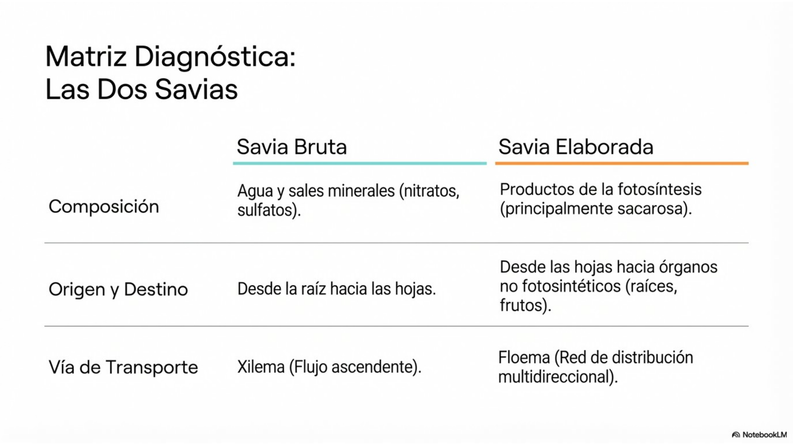{width="6.009722222222222in"}
:::

# 2. Función de Relación: Respuestas y Fitohormonas, Adaptaciones al medio

Las plantas son organismos sin capacidad de movimiento y por ello necesitan ajustar de forma exhaustiva su desarrollo a los cambios en el medio ambiente. Para ello tienen **receptores** que permiten percibir esos cambios (fotorreceptores para la luz, por ejemplo) y utilizan **fitohormonas como las auxinas, citoquininas y el etileno,** sustancias que actúan en concentraciones muy bajas y que **sirven de mensajeros** químicos induciendo cambios en el desarrollo vegetal.

::: {style="text-align:center;"}
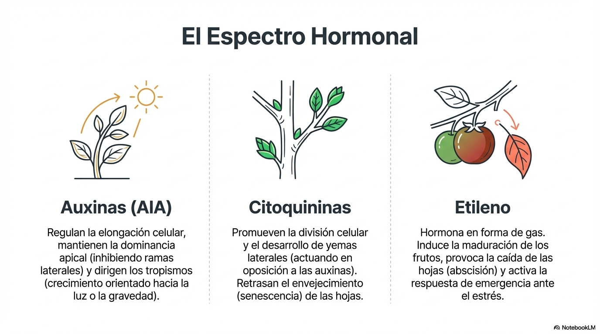{width="6.270138888888889in" height="2.8930555555555557in"}**Adaptaciones al Medio**
:::

Las plantas presentan una gran plasticidad para adaptarse a su ecosistema. Comprender estas adaptaciones es vital para el estudio de la biodiversidad y la restauración de ecosistemas en zonas degradadas.

Los principales **factores abióticos** que afectan a las plantas son la luz, el agua, la temperatura y el tipo de suelo.

- **Adaptaciones Anatómicas:** En zonas desérticas, las hojas pueden desarrollar pelos o aumentar las **ceras cuticulares** para reflejar la luz y reducir la pérdida de agua, generación de tallos carnosos (suculencia) y raíces muy profundas.

- **Ajustes Fisiológicos:** La capacidad de reorientar los cloroplastos o realizar **seguimiento solar** (solar tracking) permite maximizar la absorción de energía según la intensidad luminosa del entorno. También les permite adaptarse a diversos tipos de suelos, así las **plantas halófitas**, sobreviven en suelos salinos.

**Adaptaciones a factores abióticos**

::: {style="text-align:center;"}
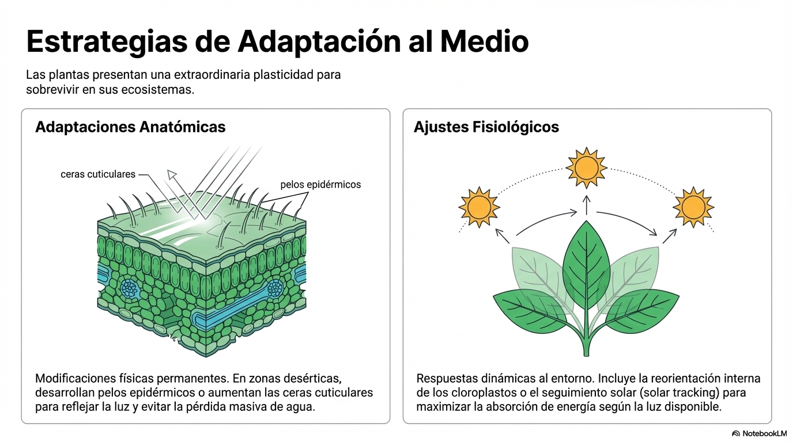{width="6.270138888888889in"}
:::

Las plantas se relacionan con el resto de los seres vivos del ecosistema, por lo que también tienen que adaptarse a **factores bióticos**. Tienen que comunicarse con otras plantas para generar respuestas de defensa y protegerse de herbívoros y parásitos y también han conseguido optimizar la interacción con insectos polinizadores, asegurarse la dispersión de las semillas o establecer simbiosis que mejoran la absorción de nutrientes por las raíces (micorrizas).

::: {style="text-align:center;"}
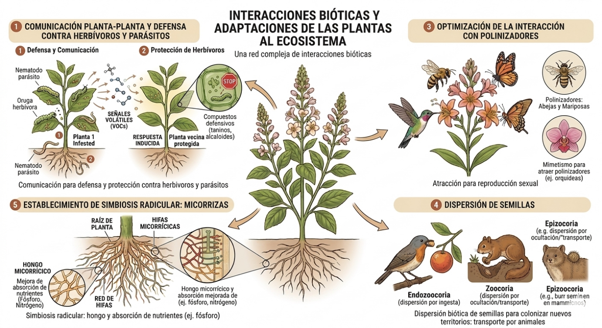{width="6.270138888888889in"}
:::

# 3. Función de Reproducción

Aunque muchas plantas pueden reproducirse **asexualmente** (propagación vegetativa mediante **tubérculos** (patata), **bulbos** (cebolla), **estolones** (fresa)), la reproducción sexual es considerada el método principal para la colonización de nuevas áreas y la diversificación genética.

La reproducción asexual tiene la ventaja de que permite una colonización muy rápida y eficiente del entorno si las condiciones son favorables y estables y no requiere el gasto energético de producir flores o atraer polinizadores. Sin embargo, una enfermedad o cambio ambiental adverso puede eliminar a toda la población (clon) al ser todos igualmente vulnerables.

::: {style="text-align:center;"}
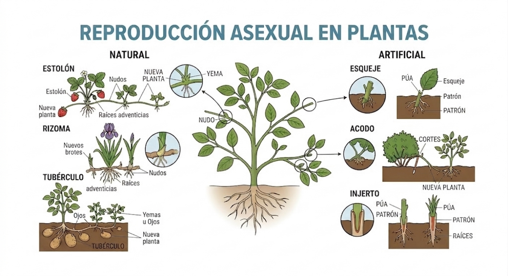{width="6.270138888888889in"}
:::

La reproducción sexual tiene la enorme ventaja de que permite la recombinación genética en la meiosis. Esto genera variabilidad en la descendencia, crucial para la adaptación a ambientes cambiantes y la supervivencia a largo plazo de la especie.

El desarrollo vegetal incluye una transición desde una **fase vegetativa** (formación de raíces, tallos y hojas) a una **fase reproductora** (formación de flores y frutos en angiospermas) impulsada por señales ambientales como la luz o el frío.

::: {style="text-align:center;"}
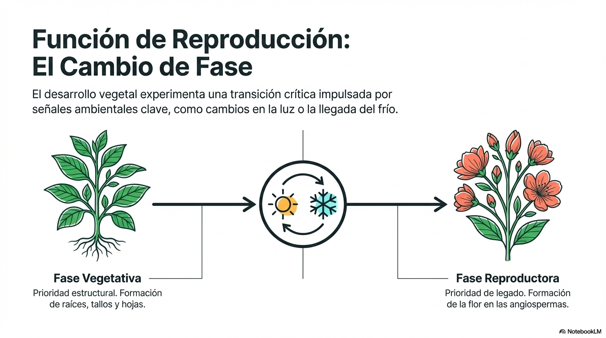{width="5.9115791776028in" height="3.297232064741907in"}
:::

En las plantas con flor (Angiospermas), los pasos son:

- **Polinización:** Transporte del polen desde la antera al estigma. Puede ser anemógama (viento) o entomógama (insectos).

- **Fecundación:** Unión de gametos. En angiospermas es **doble fecundación**, formando el embrión y el endospermo (nutrientes). El cigoto se desarrolla en la semilla y el ovario se transforma en fruto para facilitar la protección y la dispersión de la especie.

- **Dispersión:** Tras la formación de la semilla y el fruto, estos deben alejarse de la planta madre para evitar competencia y asegurar la supervivencia de la especie.

::: {style="text-align:center;"}
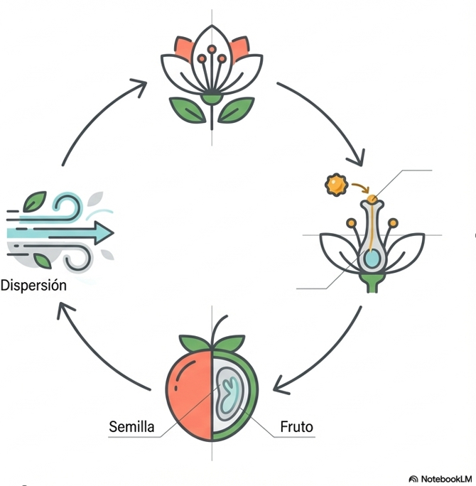{width="2.6655293088363954in"}
:::

La semilla puede quedar en estado latente (dormición) durante mucho tiempo, pero cuando las condiciones del medio son adecuadas, inicia su germinación, dando lugar a una plántula que iniciará su crecimiento vegetativo.
