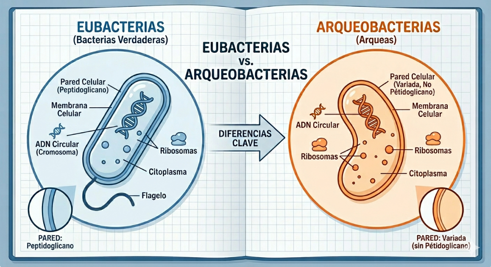
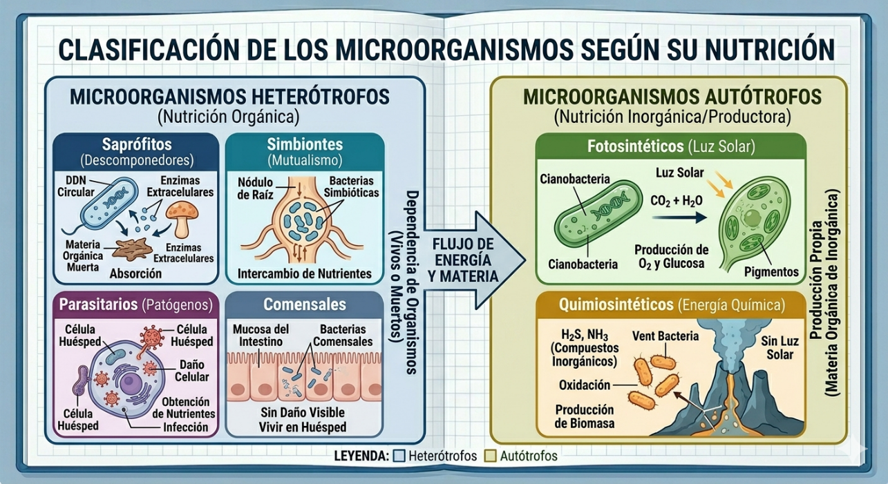
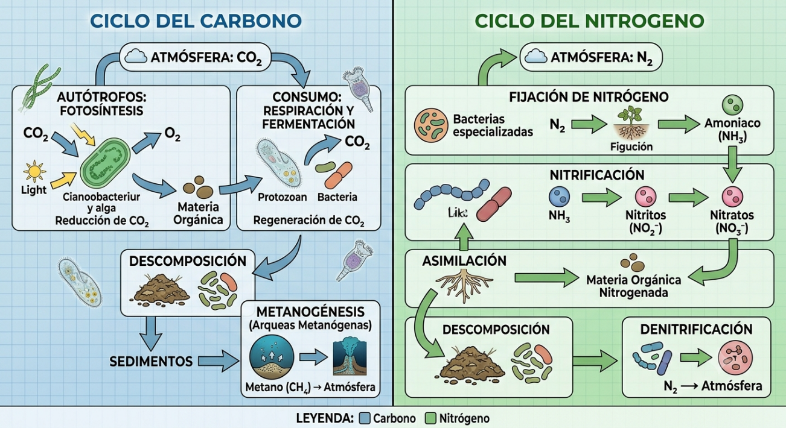
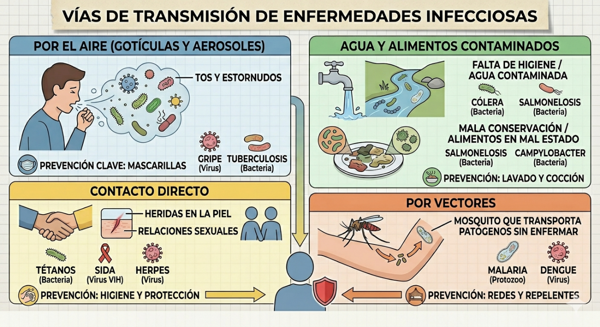
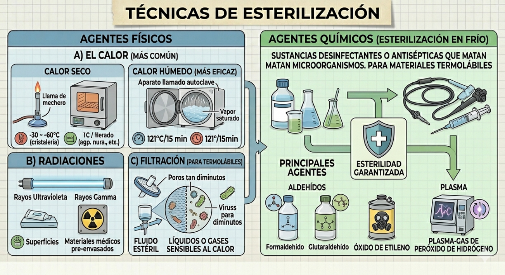
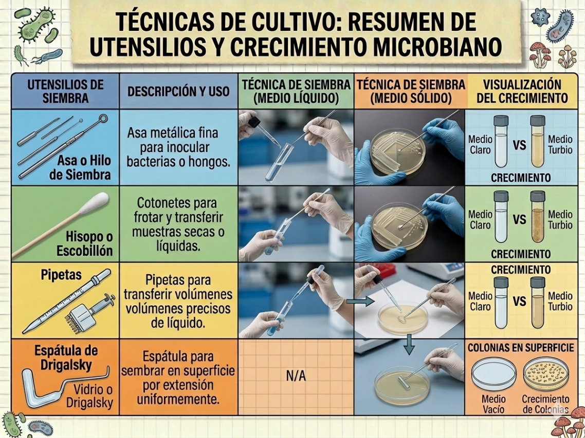
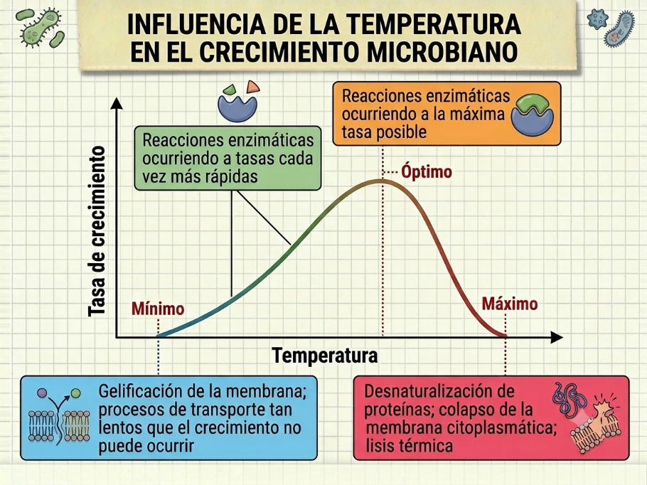
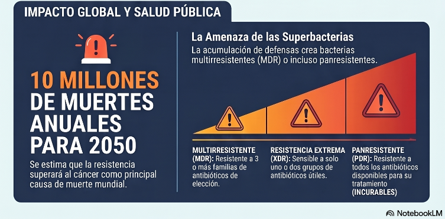
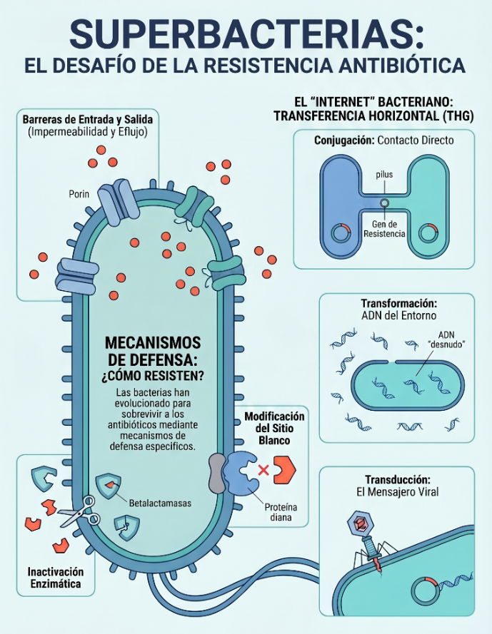
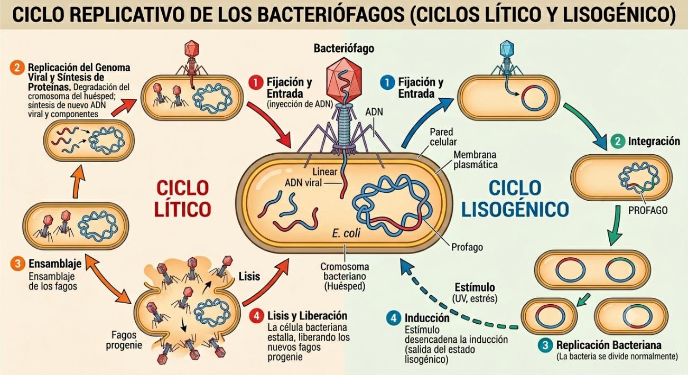

# 1. Los tres dominios de la vida

En Microbiología se diferencian claramente 3 dominios de la vida: bacterias, arqueas y eucarias. Debido a su diminuto tamaño, estos seres vivos solo pueden ser observados mediante el uso de microscopios. Las bacterias y las arqueas son microorganismos procariotas, aunque en el pasado se clasificaban juntas, hoy pertenecen a dominios evolutivos diferentes (Bacteria y Archaea), siendo las arqueas una rama fundamental del árbol de la vida más semejantes, a nivel molecular, a los organismos eucariotas que a las propias bacterias.Ambos grupos desempeñan papeles esenciales en la biosfera, siendo capaces de colonizar desde ambientes cotidianos hasta los entornos más extremos del planeta.

La célula es la unidad estructural, funcional y genética de los organismos vivos. En la naturaleza, existen dos modelos fundamentales de organización celular: la **procariota** y la **eucariota**. La principal diferencia se basa en la compartimentación (orgánulos) de su citoplasma y en la estructura de su material genético.

Con respecto a su **Material Genético**: Las células procariotas carecen de membrana nuclear, su ADN es una única molécula que está libre en el citoplasma. El ADN procariota es una molécula de doble cadena (dc), Circular y Cerrada Covalentemente (CCC), acompañada a menudo por plásmidos (ADN extracromosómico). Las células eucariotas poseen un núcleo definido con varios cromosomas lineales y se dividen por mitosis.
Con respecto a su **Compartimentación**: la célula eucariota presenta orgánulos, como las mitocondrias o los cloroplastos, mientras que en la procariota su ADN es un anillo único y cerrado que flota libre. Pero la célula procariota tiene un extra: los plásmidos, esas pequeñas moléculas de ADN adicionales que le dan, por ejemplo, resistencia a antibióticos. A menudo se piensa que los procariotas son simples porque no tienen núcleo, pero esa es una visión muy limitada. La diferencia fundamental con los eucariotas (como vuestras propias células) está en la organización del citoplasma

+---------------------+-------------------------------------------+--------------------------------------+
| [**1. MATERIAL GENÉTICO EN PROCARIOTAS Y EUCARIOTAS**]{style="display:block;text-align:center"}        |
+---------------------+-------------------------------------------+--------------------------------------+
|                     | PROCARIOTA                                | EUCARIOTA                            |
+=====================+===========================================+======================================+
| **ADN**             | Cromosoma: molécula única dc, CCC         | Varios cromosomas lineales           |
|                     |                                           |                                      |
|                     | Material genético adicional: plásmidos    | No plásmidos                         |
+---------------------+-------------------------------------------+--------------------------------------+
|**Membrana nuclear** | No                                        | Sí                                   |
+---------------------+-------------------------------------------+--------------------------------------+
|**División: mitosis**| No                                        | Sí                                   |
+---------------------+-------------------------------------------+--------------------------------------+

Los procariotas tienen una membrana citoplasmática sin esteroles, salvo en los micoplasmas.  Mientras que los eucariotas como los animales, las plantas y nosotros mismos, presentan colesterol y fitosterol, principalmente. Los hongos y levaduras tienen mayoritariamente ergosterol.

Como ya hemos comentado, las células procariotas no tienen orgánulos membranosos típicos (como mitocondrias o aparato de Golgi), pero sí presentan estructuras internas y orgánulos como vacuolas de gas para flotar o magnetosomas para orientarse. 

Con respecto a sus ribosomas, también son distintos. Los ribosomas son pequeños orgánulos encargados de sintetizar las proteínas. Los ribosomas procariotas son 70S, y los eucariotas son 80S, excepto en mitocondrias y cloroplastos que también son 70S.

Finalmente, las células procariotas no son bolsas de líquido sin forma, tiene un citoesqueleto formado por proteínas estructurales. Mientras que el citoesqueleto de las eucariotas es complejo, dinámico y compuesto por microfilamentos, filamentos intermedios de actina y microtúbulos de tubulina, esenciales para la estructura celular.

+----------------------------+-----------------------------------+-------------------------------------------+
| [**2. ORGANIZACIÓN DEL CITOPLASMA**]{style="display:block;text-align:center"}                              |
+----------------------------+-----------------------------------+-------------------------------------------+
|                            | **PROCARIOTA**                    | **EUCARIOTA**                             |
+============================+===================================+===========================================+
| **Membrana citoplasmática**| Sin esteroles salvo en            | Con esteroles                             |
|                            | micoplasmas                       |                                           |
|                            |                                   | **Humanos y animales-plantas:**           |
|                            |                                   | colesterol - fitosterol                   |
|                            |                                   |                                           |
|                            |                                   | **Hongos y levaduras:**                   |
|                            |                                   | ergosterol                                |
+----------------------------+-----------------------------------+-------------------------------------------+
| **Orgánulos membranosos**  | No                                | Sí                                        |
| **"típicos"**              |                                   |                                           |
+----------------------------+-----------------------------------+-------------------------------------------+
| **Ribosomas**              | **70S**                           | **80S** (salvo en mitocondrias y          |
|                            |                                   | cloroplastos que son 70S)                 |
+----------------------------+-----------------------------------+-------------------------------------------+

Otras diferencias significativas son a nivel de pared celular y movilidad. La pared celular es una capa rígida y resistente situada por fuera de la membrana plasmática dando soporte, protección y forma a la célula. La pared celular procariota bacteriana es única por contener peptidoglucano (PG), algo que nunca aparece en las paredes de plantas u hongos, cuya composición química suele ser celulosa o quitina, respectivamente. Además, los flagelos procariotas están compuestos de flagelina y rotan, mientras que los eucariotas están formados por microtúbulos y no rotan.

+----------------------------+-----------------------------------+-------------------------------------------+
| [**3. OTRAS DIFERENCIAS SIGNIFICATIVAS**]{style="display:block;text-align:center"}                         |
+----------------------------+-----------------------------------+-------------------------------------------+
|                            | **PROCARIOTA**                    | **EUCARIOTA**                             |
+============================+===================================+===========================================+
| **Pared celular**          | Presente en la mayoría,          | Presente en plantas, algas,                |
|                            | con moléculas exclusivas         | hongos y algunos protozoos,                |
|                            | (**peptidoglucano, PG,**         | naturaleza diferente                       |
|                            | en bacterias)                    | (**nunca PG**)                             |
+----------------------------+-----------------------------------+-------------------------------------------+
| **Flagelos**               | Con flagelina                    | Con microtúbulos                           |
|                            | **Rotan**                        | **No rotan**                               |
+----------------------------+-----------------------------------+-------------------------------------------+

Aunque **las Bacterias y las Arqueas** son organismos procariotas unicelulares sin núcleo definido, presentan diferencias bioquímicas y genéticas fundamentales:

- **Pared celular:** Las bacterias poseen una pared de peptidoglicano. Las arqueas carecen de esta sustancia y utilizan pseudopeptidoglicano o proteínas.
- **Lípidos de membrana:** En las bacterias, los ácidos grasos se unen al glicerol mediante enlaces éster. En las arqueas, utilizan cadenas ramificadas de isopreno unidas por enlaces éter, lo que les confiere mayor estabilidad en ambientes extremos.
- **Maquinaria genética:** Las arqueas tienen una ARN polimerasa y ribosomas más parecidos a los de las células eucariotas que a los de las bacterias. Por lo tanto, las arqueobacterias están evolutivamente más cerca de los eucariotas en su maquinaria genética y molecular que de las eubacterias.

::: {style="text-align:center;"}
{width="5.002981189851268in"}
:::

# 2. El metabolismo bacteriano e importancia ecológica

El metabolismo bacteriano es extraordinariamente diverso, lo que les permite ocupar prácticamente todos los nichos ecológicos del planeta y desempeñar funciones esenciales para el mantenimiento de la biosfera.

La mayoría de las bacterias son **heterótrofas**, lo que significa que obtienen el carbono de materia orgánica sintetizada por otros organismos. Según su estilo de vida, pueden ser:

- **Saprófitas:** se alimentan de la materia orgánica muerta, actuando como los principales descomponedores de los ecosistemas.

- **Simbiontes:** establecen relaciones de beneficio mutuo con otros seres vivos.

- **Parasitarias:** obtienen nutrientes a expensas de un huésped, al que suelen causar enfermedades.

- **Comensales:** viven asociadas a un huésped sin beneficiarlo ni perjudicarlo.

Por otro lado, existen microorganismos **autótrofos** que utilizan compuestos inorgánicos. Estos se dividen en:

- **Fotosintéticos:** Utilizan la luz como fuente de energía.

- **Quimiosintéticos:** Obtienen energía de la oxidación de compuestos inorgánicos.

::: {style="text-align:center;"}
{width="5.8342125984251965in"}
:::

## Importancia Ecológica: ciclos biogeoquímicos y simbiosis

Los microorganismos son piezas fundamentales para la vida en la Tierra debido a su papel crucial en los ciclos biogeoquímicos, como los del carbono y el nitrógeno.

### Ciclo del Carbono

- **Producción y consumo:** Los autótrofos (cianobacterias, algas y bacterias quimiosintéticas) reducen el CO~2~ para incorporarlo a la materia orgánica. Los descomponedores (bacterias y hongos) regeneran el CO~2~ mediante la respiración y la fermentación de restos orgánicos y excrementos.

- **Metanogénesis:** es un proceso exclusivo de ciertas arqueas metanógenas que producen gas metano (CH~4~) en condiciones anaerobias, como pantanos o el tracto digestivo de animales.

### Ciclo del Nitrógeno

Este ciclo depende casi por completo de la actividad bacteriana, ya que las plantas no pueden usar el nitrógeno atmosférico (N~2~) directamente:

1.  **Fijación:** Bacterias como *Rhizobium* (en simbiosis con leguminosas) y *Azotobacter* transforman el N~2~ en amonio (NH~4~^+^).

2.  **Nitrificación:** Bacterias aerobias (como *Nitrosomonas* y *Nitrobacter*) convierten el amoniaco en nitritos y luego en nitratos, la forma en que las plantas absorben el nitrógeno.

3.  **Desnitrificación:** Bacterias como *Pseudomonas* cierran el ciclo devolviendo el nitrógeno a la atmósfera mediante respiración anaerobia.

::: {style="text-align:center;"}
{width="5.905555555555556in"}
:::

## Simbiosis y Aplicaciones Ambientales

- **Digestión Animal:** Las arqueas metanógenas son vitales en el sistema digestivo de rumiantes y termitas, donde ayudan a degradar la celulosa, permitiendo que el animal aproveche la energía de las plantas.

- **Biorremediación:** El metabolismo microbiano se aprovecha para limpiar la contaminación humana. Por ejemplo, las bacterias del género *Pseudomonas* pueden degradar hidrocarburos en mareas negras. También se emplean bacterias en las estaciones depuradoras de aguas residuales (EDAR) para descomponer la materia orgánica y producir biogás.

- **Industria:** Algunas levaduras y bacterias realizan fermentaciones esenciales para fabricar alimentos como el vino, el queso o el yogur.

# 3. Los microorganismos como agentes de enfermedades infecciosas

Aunque la mayoría de los microorganismos son inofensivos e incluso necesarios (como nuestra microbiota intestinal), los microorganismos patógenos son aquellos capaces de invadir un ser vivo y provocarle una enfermedad infecciosa. La gravedad depende de su virulencia, que es la capacidad para hacernos enfermar.

Los microorganismos utilizan distintas vías para pasar de un huésped a otro, para contagiarlo y transmitir la enfermedad:

- Por el aire: Al toser, estornudar o hablar (ej. la gripe o la tuberculosis).

- En el agua o en alimentos contaminados: Por falta de higiene o mala conservación (ej. el cólera o la salmonelosis).

- Por contacto directo: Incluyendo heridas en la piel o relaciones sexuales (ej. el tétanos o el SIDA).

- Por vectores: Animales que transportan el patógeno sin enfermar (ej. el mosquito que transmite la malaria).

::: {style="text-align:center;"}
{width="5.921739938757655in"}
:::

Los principales agentes infecciosos son las bacterias, los virus, los protozoos y los hongos. Curiosamente, a diferencia de las bacterias, las arqueas se consideran importantes para la vida y, hasta la fecha, no se conoce ninguna arquea que sea patógena para el ser humano.

[Conceptos clave: Zoonosis y Epidemias]{.underline}

Es fundamental distinguir el alcance de estas enfermedades:

- **Zoonosis:** Son enfermedades infecciosas que pasan de los animales a los humanos, como la rabia, la peste o la gripe porcina.

- **Epidemia:** Ocurre cuando una enfermedad afecta a un número muy alto de personas en una zona concreta y en poco tiempo.

- **Endemia:** Cuando la enfermedad está presente de forma permanente en una región específica (ej. la malaria en zonas de África).

- **Pandemia:** Es una epidemia que se extiende a nivel global por todo el planeta (ej. el SIDA o la COVID-19).

# 4. El cultivo de microorganismos: esterilización y técnicas

Para estudiar los microorganismos, los científicos necesitan trabajar con cultivos puros o axénicos, que son poblaciones donde todos los individuos son del mismo tipo. Para lograrlo, es fundamental trabajar en condiciones de esterilidad.

## Métodos de esterilización

La esterilización es el tratamiento de un material con un agente físico o químico que elimina TODO tipo de actividad biológica en él. Se trata de un término absoluto porque no admite grados intermedios: algo está estéril o no lo está. Una vez estéril, el material seguirá estéril indefinidamente mientras esté almacenado en un compartimiento estanco, sellado y libre del contacto con microorganismos del ambiente exterior.

::: {style="text-align:center;"}
{width="5.905555555555556in"}
:::

Los [agentes físicos]{.underline} más empleados son:

a\) El calor: que es el más común. Puede ser calor seco (como la llama de un mechero o un horno) o calor húmedo (en atmósfera saturada de vapor de agua), que es más eficaz y se realiza en un aparato llamado autoclave.

b\) Las radiaciones: se suelen usar rayos ultravioleta o rayos gamma.

c\) La filtración: Para líquidos o gases que no pueden calentarse, se usan filtros con poros tan diminutos que no dejan pasar a los microorganismos.

Los [agentes químicos]{.underline} más comunes son sustancias desinfectantes o antisépticas que matan a los microorganismos. La esterilización mediante agentes químicos se conoce como esterilización en frío y se utiliza para esterilizar materiales termolábiles, es decir, materiales sensibles al calor. Los principales agentes químicos usados para esterilizar en frío son los Aldehídos (Formaldehído y Glutaraldehído), el Óxido de etileno y el Plasma-gas de peróxido de hidrógeno.

## Técnicas de cultivo

Para que un microorganismo crezca, hay que prepararle un \"alimento\" adecuado. Un medio de cultivo es un conjunto de nutrientes y otros componentes que crean las condiciones necesarias para el desarrollo de los microorganismos en el laboratorio. La diversidad metabólica de los microorganismos es tan grande que la variedad de medios de cultivo es enorme, por lo que no existe un medio de cultivo universal adecuado para todos. Algunas bacterias crecen fácilmente en cualquier medio de cultivo, otras requieren medios especiales y otras no se pueden desarrollar en ningún medio artificial (se llaman bacterias no cultivables).

Los medios de cultivo se pueden clasifican según su consistencia en: sólidos (con 1,5 - 2% de agar-agar), semisólidos (agar al 0,7%) y líquidos (sin agar). El agar es agente gelificante vegetal (polisacárido natural) derivado de las algas rojas marinas. El agar-agar también se usa en cocina, como espesante.

La siembra es la incorporación de una muestra o inóculo bacteriano a un medio de cultivo, siempre en condiciones de esterilidad. Existen distintas técnicas de siembra según el tipo de medio del que partamos y el tipo de medio en el que sembremos.

::: {style="text-align:center;"}
{width="5.175120297462817in"}
:::

El crecimiento en cultivos cerrados tiene cuatro fases: **latencia**, **exponencial**, **estacionaria** y **muerte**:

1.  **Fase de latencia (o adaptación):** Las bacterias se acostumbran al nuevo medio y no hay un aumento notable de la población.

2.  **Fase exponencial:** Tras adaptarse, las bacterias se dividen rápidamente y su número crece de forma logarítmica.

3.  **Fase estacionaria:** El crecimiento se detiene y se estabiliza porque la comida empieza a agotarse y se acumulan desechos tóxicos.

4.  **Fase de muerte:** Al acabarse los recursos y envenenarse el medio, el número de bacterias cae rápidamente.

::: {style="text-align:center;"}
{width="4.121738845144357in"}
:::

# 5. Transferencia genética horizontal y resistencia a antibióticos

Las bacterias pueden intercambiar material genético sin reproducirse (la llamada herencia vertical), mediante la Transferencia Genética Horizontal. Esta representa uno de los mecanismos evolutivos más dinámicos en el mundo microbiano. A diferencia de la herencia vertical, la Transferencia Genética Horizontal permite el intercambio de material genético entre organismos no emparentados, facilitando una adaptación acelerada a presiones selectivas en su entorno.

Tabla de los tres mecanismos principales de Transferencia Genética Horizontal

  --------------------------------------------------------------------------------------------------------------------------------------------------------
  **Mecanismo**        **¿En qué consiste?**                                                       **Agente clave**
  -------------------- --------------------------------------------------------------------------- -------------------------------------------------------
  **Transformación**   La bacteria capta fragmentos de ADN libre del medio ambiente.               ADN desnudo

  **Transducción**     El ADN se transfiere de una bacteria a otra a través de un virus.           Bacteriófago (virus que infectan bacterias)

  **Conjugación**      Intercambio directo de material genético (plásmidos) entre dos bacterias.   Pili sexual (en Gram -)/ Contacto directo (en Gram +)
  --------------------------------------------------------------------------------------------------------------------------------------------------------

Los **plásmidos** son los protagonistas absolutos de la conjugación. Puedes imaginarlos como \"paquetes de información extra\" o manuales de instrucciones portátiles que no forman parte del cromosoma principal de la bacteria. Sin plásmidos, la conjugación no ocurriría y la propagación de resistencias sería mucho más lenta.

## El Gran Desafío: la Resistencia a Antibióticos

La resistencia puede ser natural (propia de la especie) o adquirida (por mutación o Transferencia Genética Horizontal). La Transferencia Genética Horizontal es el principal motor de expansión de las superbacterias. Hoy en día, las resistencias matan más que los accidentes de tráfico en nuestro país. Además, factores como la dieta pueden influir en la frecuencia de estos intercambios genéticos en nuestra microbiota intestinal.

Por lo tanto, la transferencia de plásmidos con genes de resistencia entre bacterias es un problema grave de salud pública, ya que permite que las cepas patógenas sobrevivan a los tratamientos médicos. Mediante este proceso, las poblaciones bacterianas pueden adquirir y difundir genes de resistencia con gran rapidez, transformando la dinámica de las infecciones y planteando un desafío importante para la salud pública y las ciencias ambientales.

::: {style="text-align:center;"}
{width="5.165217629046369in"}
:::

Los principales mecanismos que usan las bacterias para resistir a los antibióticos son:

1.  **Inactivación enzimática:** Producción de enzimas como las betalactamasas, que hidrolizan el antibiótico (como la penicilina) antes de que actúe.

2.  **Impermeabilidad:** Mutaciones en las porinas (proteínas de transporte) que impiden que el fármaco entre en la célula.

3.  **Modificación del sitio blanco:** Alteración de la molécula a la que el antibiótico debe unirse, dejando al fármaco sin \"diana\".

4.  **Bombas de eflujo:** Proteínas de membrana que expulsan activamente el antibiótico hacia el exterior de la bacteria.

::: {style="text-align:center;"}
{width="5.1393897637795276in"}
:::

# 6. Las formas acelulares: virus, viroides y priones

Dentro del estudio de la microbiología, encontramos entidades que desafían la definición tradicional de ser vivo. Las formas acelulares (virus, viroides y priones) se consideran estructuras biológicas, pero no organismos vivos, ya que carecen de metabolismo propio y son parásitos obligados. Al no poseer la maquinaria necesaria para obtener energía o materia de forma autónoma, dependen totalmente de una célula hospedadora para replicarse.

a)  **Los Virus: estrategas de la infección**

  Los virus son agentes infecciosos de estructura simple, compuestos fundamentalmente por un ácido nucleico (que puede ser ADN o ARN) envuelto en una cubierta proteica llamada cápsida, formada por unidades menores llamadas capsómeros. Algunos virus poseen además una envoltura membranosa externa que les ayuda a reconocer a sus células diana.

  Para multiplicarse, los virus alternan entre un estado inerte (virión) y un estado activo intracelular mediante dos tipos de ciclos:

  - [Ciclo Lítico]{.underline}: El virus secuestra la maquinaria celular para fabricar nuevas copias de sí mismo, provocando finalmente la lisis o ruptura de la célula hospedadora para liberar la progenie viral.

  - [Ciclo Lisogénico]{.underline}: El material genético del virus se integra en el genoma de la célula (en este estado se denomina profago), permaneciendo de forma latente sin destruirla inmediatamente. El virus se replica junto con la célula hasta que un estímulo externo activa su paso al ciclo lítico.

::: {style="text-align:center;"}
{width="5.905555555555556in"}
:::

b)  **Los Viroides: simplicidad genética**

  Los viroides son entidades aún más sencillas que los virus. Se componen exclusivamente de una pequeña molécula de ARN monocatenario circular \"desnudo\", es decir, carecen de cualquier tipo de cápsida proteica. Aunque no codifican proteínas, son capaces de replicarse utilizando las enzimas de la célula infectada. Su acción patógena se limita exclusivamente al reino vegetal, donde causan importantes enfermedades agrícolas.

c)  **Los Priones: proteínas que \"contagian\"**

  Los priones representan un caso extraordinario en biología, ya que son partículas infecciosas de naturaleza puramente proteica que carecen de ácidos nucleicos. Se trata de versiones anormalmente plegadas de proteínas que ya existen en el organismo (como la proteína PrPc en el cerebro).

Lo que hace peligrosos a los priones es su capacidad de inducir un \"cambio conformacional\" en las proteínas normales, transformándolas en formas defectuosas en un efecto de cascada. Esta acumulación de proteínas anómalas provoca la muerte neuronal y causa enfermedades neurodegenerativas letales, tales como la encefalopatía espongiforme bovina (conocida popularmente como el mal de las \"vacas locas\") y la enfermedad de Creutzfeldt-Jakob en humanos, que conlleva un deterioro progresivo de las capacidades mentales y motoras.
