# 1.Las Biomoléculas: Fundamentos De La Materia Viva

La materia viva se organiza mediante principios físicos y químicos universales, pero se distingue por una organización molecular de alta complejidad basada en los **bioelementos** (elementos de la materia viva). La materia viva utiliza únicamente una fracción de los elementos que tiene a su disposición en la naturaleza, concentrando algunos de ellos. Así H, C, O y N que constituyen los **bioelementos primarios**, representan una baja proporción de la materia inerte, pero forman el 96% de la masa total de la materia viva. Esto es debido:

- Todos estos elementos forman con facilidad enlaces covalentes estables.

- Tienen una considerable versatilidad para el enlace químico, pueden reaccionar fácilmente unos con otros mediante enlaces simples, dobles o triples.

El resto de bioelementos forman lo que se denomina **oligoelementos**, con diferentes funciones como biocatalizadores en reacciones metabólicas, transportadores, etc.

Las biomoléculas se pueden clasificar en Biomoléculas Orgánicas e Inorgánicas:

- **Inorgánicas:** Son moléculas sencillas, pobres en energía y presentes tanto en seres vivos como en materia inerte (agua, sales minerales, gases).

- **Orgánicas:** Basadas en el **carbono**, cuya configuración tetraédrica le permite formar cadenas y anillos estables y variados (glúcidos, lípidos, proteínas y ácidos nucleicos).

::: {style="text-align:center;"}
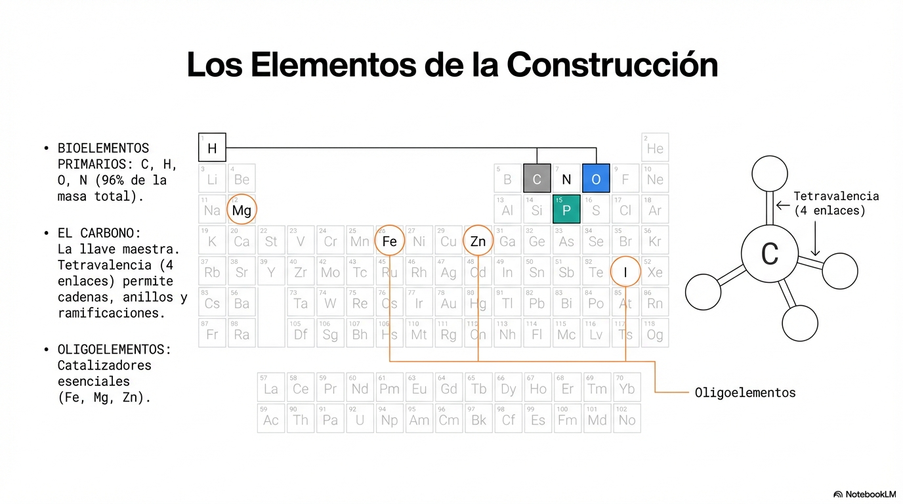{width="6.270138888888889in"}
:::

# 2. El Agua y las Sales Minerales

**El agua** es la sustancia más abundante en la biosfera, dónde la encontramos en sus tres estados.

Componente más abundante en los seres vivos, aproximadamente un 70 por ciento de un ser vivo es agua, aunque este porcentaje varía según se trate de una célula animal o una vegetal, dentro de los diferentes tejidos, en diferentes formas de vida, etc

## Propiedades del agua

El Agua se comporta como un dipolo (carga parcial negativa en el oxígeno y positiva en los hidrógenos). Esto permite la formación de **puentes de hidrógeno** entre las moléculas de H2O**.** Gracias a ellos, las moléculas se mantienen unidas y el agua es líquida a temperaturas a las que otras moléculas son gaseosas**.** Estos puentes de H también son responsables de propiedades del agua:

- **Cohesión, Adhexión y Tensión Superficial:** Permite la capilaridad (ascenso de savia) y que insectos caminen sobre ella.

- **Calor Específico Elevado:** Actúa como amortiguador térmico, manteniendo la temperatura constante.

- **Densidad:** El hielo es menos denso que el agua líquida, permitiendo la vida bajo capas heladas.

- **Acción disolvente:** El agua es el disolvente universal. Esta propiedad, tal vez es la más importante para la vida. La polaridad de las moléculas de agua es la responsable de su capacidad disolvente.

::: {style="text-align:center;"}
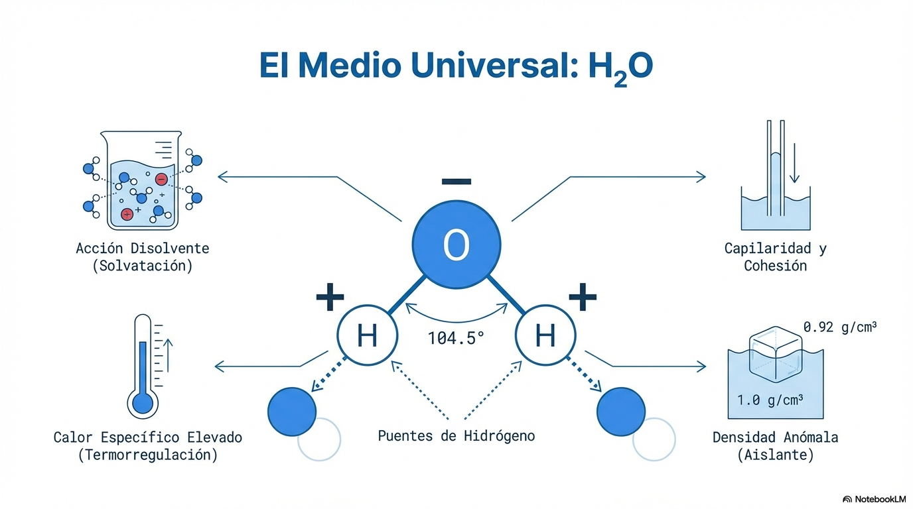{width="6.270138888888889in"}
:::

## Sales Minerales

Se pueden diferenciar:

- **Insolubles:** Función de sostén y protección (huesos de fosfato cálcico, caparazones de carbonato).

- **Solubles:** Disociadas en iones (Na+, K+, Cl-), regulan la presión osmótica, el pH (sistemas tampón como el bicarbonato) y la transmisión del impulso nervioso.

# 3. Glúcidos: Monosacáridos, Disacáridos y Polisacáridos. Isomería y Ciclación

Los carbohidratos son biomoléculas formadas básicamente por carbono (C), hidrógeno (H) y oxígeno (O) en una proporción aproximada de un carbono por dos hidrógenos y un oxígeno. (CH2O)n. Los átomos de carbono están unidos a grupos alcohólicos (-OH), llamados también radicales hidroxilos y a radicales hidrógeno (-H). En todos los glúcidos siempre hay al menos un grupo carbonilo, es decir, un carbono unido a un oxígeno mediante un doble enlace (C=O). Si el grupo carbonilo está al final de la cadena es una **aldosa**, en cualquier otra posición es una **cetosa**.

## Monosacáridos

Los monosacáridos son glúcidos sencillos, contienen de tres a siete átomos de carbono. Son sólidos, cristalinos, de color blanco, de sabor dulce y muy soluble en agua y son reductores.

Los monosacáridos presentan isomería**,** los **isómeros** son **c**ompuestos con igual fórmula molecular pero distinta estructura y propiedades lo que es muy importante para su función:

- **Estructural:** Diferente disposición de enlaces.

- **Óptica (Enantiómeros):** Basada en el **carbono asimétrico** (unido a 4 sustituyentes distintos). Se clasifican en serie **D** (OH a la derecha en el carbono asimétrico más alejado del grupo funcional) y **L** (a la izquierda). Un ejemplo crítico es la **L-Dopa** (activa contra el Parkinson) frente a su isómero D-Dopa (inactivo).

- **Ciclación:** En disolución acuosa, las aldopentosas y hexosas reaccionan internamente (reacción **hemiacetal** o **hemicetal**) para formar anillos.

  - **Piranosas:** Anillos de 6 lados (ej. glucosa).

  - **Furanosas:** Anillos de 5 lados (ej. fructosa y ribosa).

`` **Anómeros:** Al ciclarse, aparece un nuevo carbono asimétrico (anomérico), dando lugar a las formas **alfa** (OH hacia abajo) y **beta** (OH hacia arriba).``

::: {style="text-align:center;"}
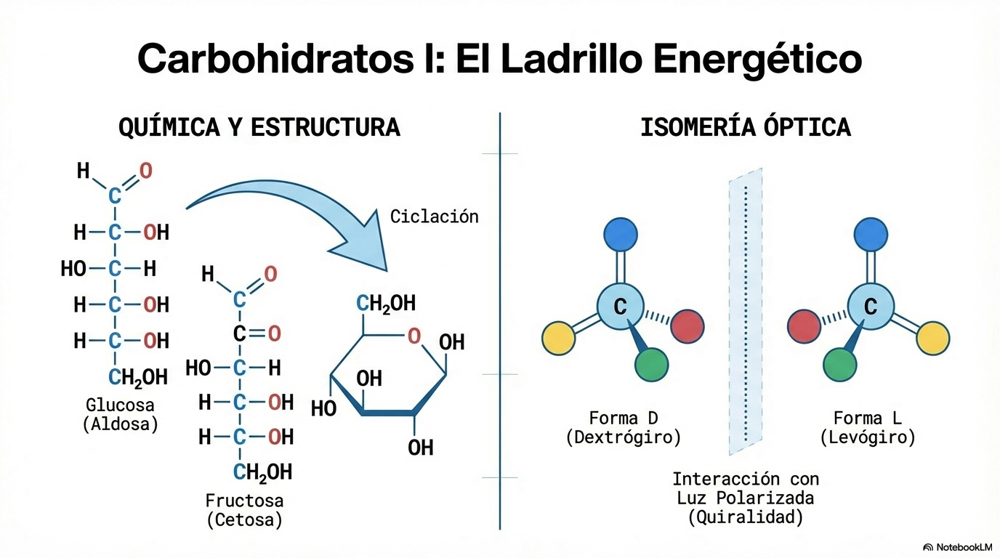{width="6.270138888888889in"}
:::

## Disacáridos y Polisacáridos

- **Disacáridos:** Unión de dos monosacáridos por enlace **O-glucosídico**. Ejemplos: **sacarosa** (transporte en plantas), **lactosa** (leche) y **maltosa** (degradación del almidón).

- **Polisacáridos:** Los polisacáridos están formados por la unión de muchos monosacáridos (puede variar entre 11 y varios miles), mediante enlace O-glucosídico. Existen polisacáridos con funciones de reserva energética como **Almidón** y **Glucógeno** y otros con funciones estructurales o de sostén como **Celulosa** y **Quitina**.

::: {style="text-align:center;"}
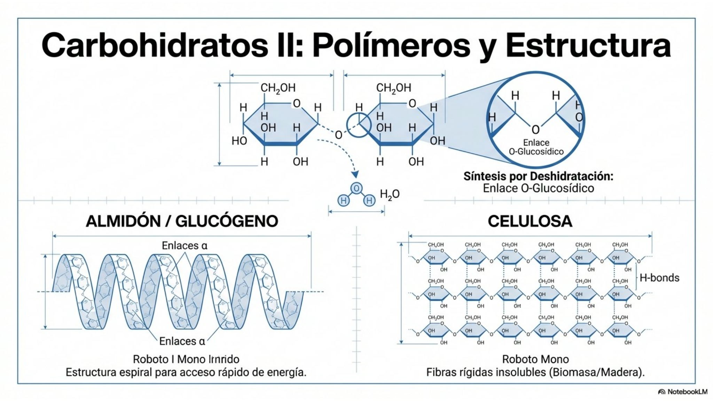{width="6.270138888888889in"}
:::

# 4. Lípidos: Saponificables y No Saponificables

Los lípidos están formados básicamente por carbono e hidrógeno y generalmente también oxígeno, pero en porcentaje mucho más bajo. Además, pueden contener también fósforo, nitrógeno y azufre. Es un grupo de sustancias muy heterogéneas que tienen en común ser insolubles en agua y solubles en disolventes orgánicos.

Los lípidos desempeñan diversas funciones biológicas:

- componentes estructurales de las membranas.

- formas de almacenamiento y transporte del combustible biológico.

- cubierta protectora sobre la superficie de muchos organismos.

Algunos lípidos poseen una intensa actividad biológica, entre ellos están algunas **vitaminas y hormonas.**

En general los lípidos se dividen en saponificables y no saponificables, según si contienen ácidos grasos o no. Los ácidos grasos pueden ser saturados o insaturados, las insaturaciones provocan torsiones en las moléculas lo que influye en sus propiedades. Así, los saturados son grasas sólidas a temperatura ambiente como la mantequilla, mientras que los insaturados son líquidos como el aceite de oliva).

::: {style="text-align:center;"}
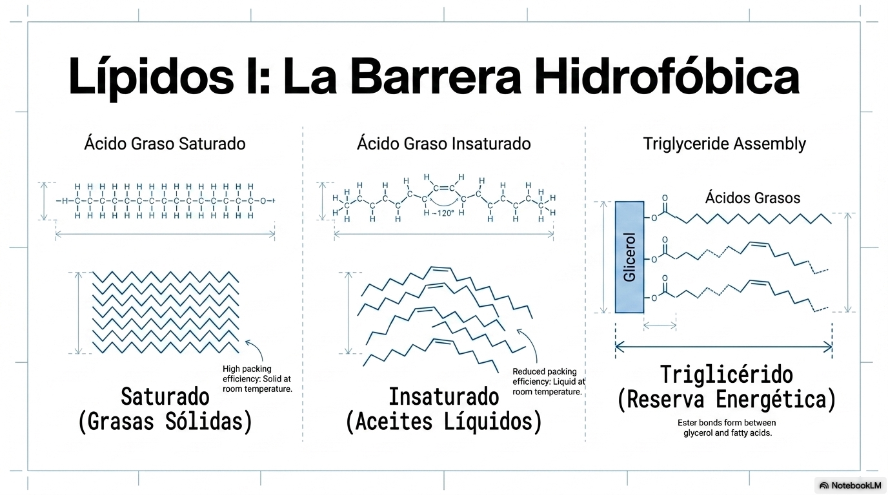{width="6.270138888888889in"}
:::

- **Saponificables (contienen ácidos grasos):**

  - **Triglicéridos:** Almacenan energía (grasas saturadas e insaturadas).

  - **Fosfolípidos:** Moléculas **anfipáticas** (cabeza polar y colas apolares de ácidos grasos) que forman las membranas celulares.

::: {style="text-align:center;"}
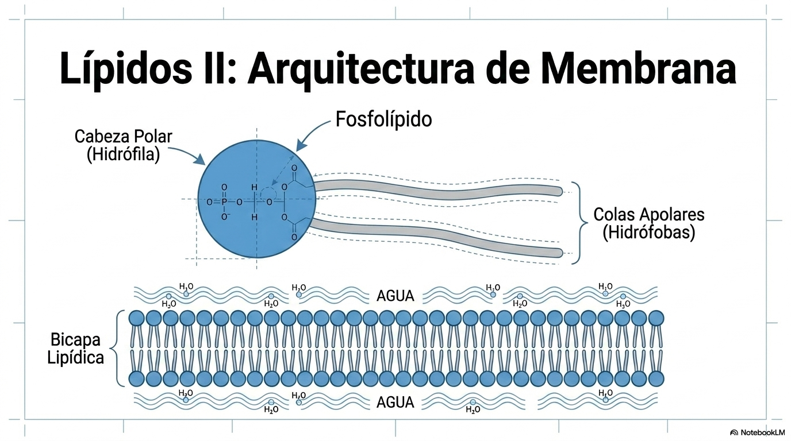{width="6.270138888888889in"}
:::

- **No Saponificables (sin ácidos grasos):**

  - **Terpenos:** Pigmentos (carotenos) y vitaminas (A, E, K).

  - **Esteroides:** Incluyen el **colesterol** y hormonas sexuales (testosterona, progesterona).

  - **Prostaglandinas:** Mensajeros celulares que intervienen en el dolor e inflamación.

# 5. Proteínas y Enzimas

Son cadenas de **aminoácidos** unidos por enlaces peptídicos. Los aminoácidos están formados por un átomo de C (Cα) unido a un grupo amino (-NH2) y a otro carboxilo (-COOH), a un átomo de hidrógeno (-H) y a un grupo químico variable al que se denomina radical (-R). Dependiendo del grupo R, los aminoácidos tienen diferentes propiedades: hidrófilos, aromáticos...

::: {style="text-align:center;"}
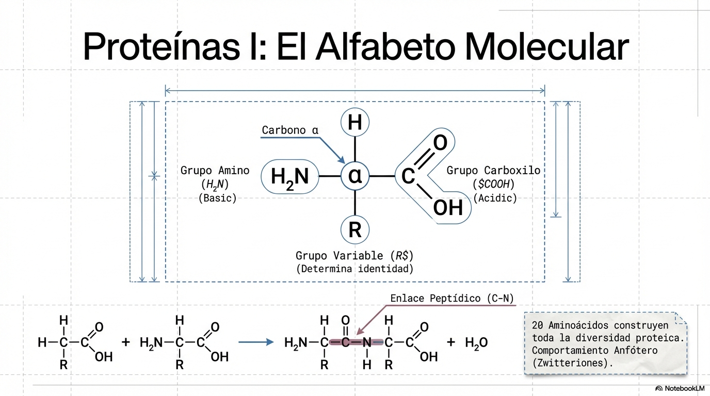{width="6.270138888888889in"}
:::

En la naturaleza existen unos 80 aminoácidos diferentes, pero de todos ellos sólo unos 20 forman parte de las proteínas.

Los aminoácidos presentan isomería D y L debido al Cα. Los isómeros de aminoácidos presentes en los seres vivos son casi exclusivamente L-isómeros.

Los aminoácidos forman péptidos mediante su unión mediante un enlace denominado enlace peptídico. Los polipéptidos (formados por más de 10 aminoácidos) forman proteínas.

## Estructura de las proteínas

La conformación tridimensional de las proteínas es fundamental para su actividad biológica. La conformación tridimensional tiene un carácter jerarquizado, es decir, implica unos niveles de complejidad creciente que dan lugar a 4 tipos de estructuras: primaria, secundaria, terciaria y cuaternaria. Cada uno de estos niveles se construye a partir del anterior.

- **La estructura primaria** es la sucesión lineal de aminoácidos que forman la cadena peptídica que no es arbitraria sino que obedece a un plan predeterminado en el ADN.

- **La estructura secundaria** es la disposición de la secuencia de aminoácidos en el espacio. Existen 2 tipos de estructura secundaria: α --hélice y la lámina ß.

- **La estructura terciaria** de una proteína es determinada por la forma que adopta cada cadena polipeptídica. Son formas tridimensionales complejas producto de interacciones entre los grupos R, como enlaces disulfuro, puentes de H, interacciones hidrofóbicas....

- **La estructura cuaternaria.** Solo afecta a proteínas compuestas de dos o más cadenas de polipéptidos. Cada una de las cadenas posee conformación primaria, secundaria y terciaria en el espacio y en conjunto forman una proteína que posee otro nivel de conformación, la estructura cuaternaria. La estructura cuaternaria se refiere a como las distintas cadenas polipeptídicas se asocian entre sí y se disponen espacialmente.

La pérdida de la conformación tridimensional de la proteína se llama **desnaturalización** y conlleva la pérdida de función de la proteína.

::: {style="text-align:center;"}
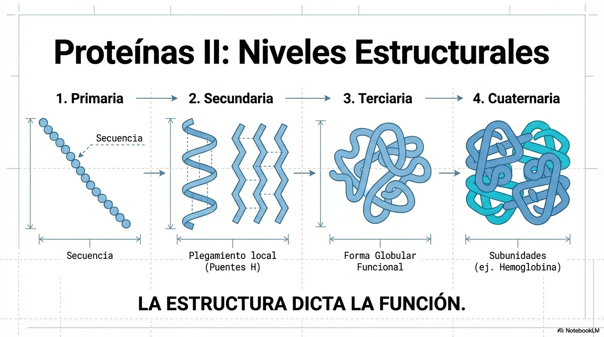{width="6.270138888888889in"}
:::

## Funciones de las proteinas 

Las proteínas desempeñan diversas **funciones**:

- [Función estructural]{.underline}. Formando las estructuras celulares: proteínas de membrana, histonas de los cromosomas, colágeno del tejido conjuntivo...

- [Reconocimiento de señales químicas]{.underline}. La superficie celular alberga un gran número de proteínas encargadas del reconocimiento de compuestos químicos de muy diverso tipo: receptores de hormonas, de neurotransmisores, de anticuerpos, etc.

- [Función de transporte]{.underline}. Los transportadores biológicos son siempre proteínas, como la hemoglobina que transporta O2, los citocromos transportan electrones.

- [Función hormonal]{.underline}. Algunas son proteínas como la insulina y el glucagón.

- [Función defensiva]{.underline}. Inmunoglobulina, trombina y fibrinógeno

- [Función de reserva]{.underline}: Constituyendo un material de reserva: Ovoalbúmina, de la clara de huevo, gliadina, del grano de trigo, lactoalbúmina, de la leche

- [Función enzimática]{.underline}. La gran mayoría de las reacciones metabólicas tienen lugar gracias a la presencia de un catalizador de naturaleza proteica específico para cada reacción. Estos biocatalizadores reciben el nombre de **enzimas**. La gran mayoría de las proteínas son enzimas.

## Enzimas

Biocatalizadores que disminuyen la **energía de activación** de las reacciones químicas, permitiendo que la vida ocurra a velocidades adecuadas.

Las enzimas alteran las velocidades de reacción pero no los equilibrios químicos.

En una reacción enzimática:

::: {style="text-align:center;"}
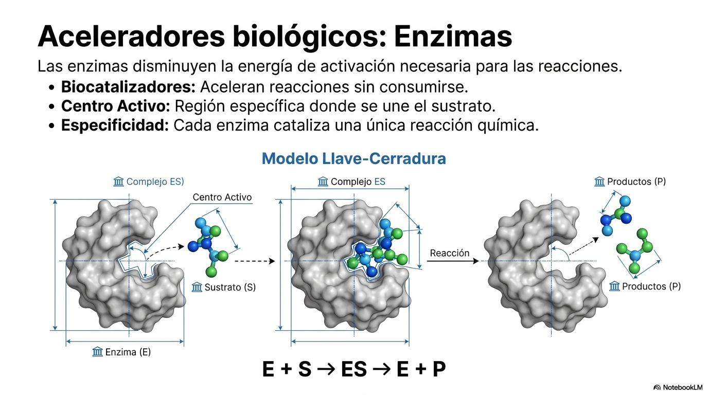{width="5.8241557305336835in"}
::: 

donde E, S y P representan enzima, sustrato y producto, respectivamente. ES y EP son complejos de la enzima con el sustrato y con el producto, respectivamente.

::: {style="text-align:center;"}
{width="5.740248250218722in"}
:::

Muchas enzimas necesitan componentes no proteicos para ser activas: **cofactores** (iones como Zn^2+^) o **coenzimas** (vitaminas).

**Importancia Dietética:** El organismo no puede sintetizar vitaminas o aminoácidos esenciales, por lo que su carencia provoca enfermedades como el escorbuto o la anemia.

# 6. Ácidos Nucleicos

Existen dos tipos de ácidos nucleicos el ADN y el ARN. Son las macromoléculas encargadas de **almacenar y transmitir la información genética**. Están formados por cadenas de **nucleótidos**.

::: {style="text-align:center;"}
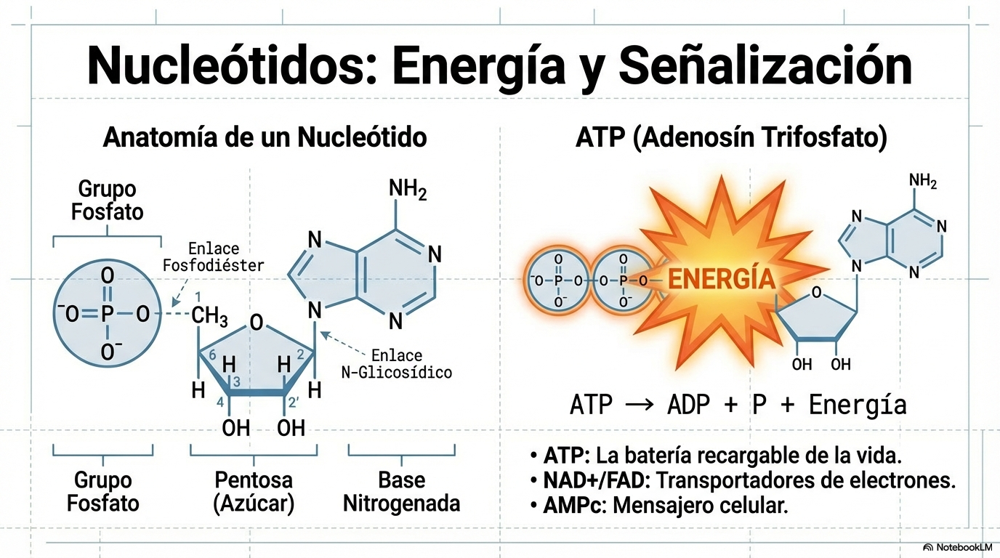{width="5.45365157480315in"}
:::

**Estructura de los nucleótidos:**

- Un azúcar pentosa (Ribosa en el ARN, Desoxirribosa en el ADN).

- Un grupo fosfato.

- Una base nitrogenada:

  -  Púricas: Adenina (A) y Guanina (G);

  - Pirimidínicas: Citosina (C), Timina (T, solo en ADN) y Uracilo (U, solo en ARN).

Los nucleótidos, además de ser los monómeros constituyentes de las cadenas de los ácidos nucleicos, pueden desempeñar otras funciones de gran importancia en el metabolismo celular**.** Así el **ATP** es un nucleótido que funciona como la **moneda energética** universal de la célula. Dinucleótidos como el FAD y el NAD funcionan como coenzimas.

**Existen diferencias clave entre ADN y ARN**:

El ADN es bicatenario (doble hélice antiparalela), muy estable, y contiene la información genética, se encuentra en el núcleo celular. La doble cadena se forma por la unión entre 2 cadenas de nucleótidos por sus bases nitrogenadas se une una base púrica y una pirimidínica A-T y G-C.

::: {style="text-align:center;"}
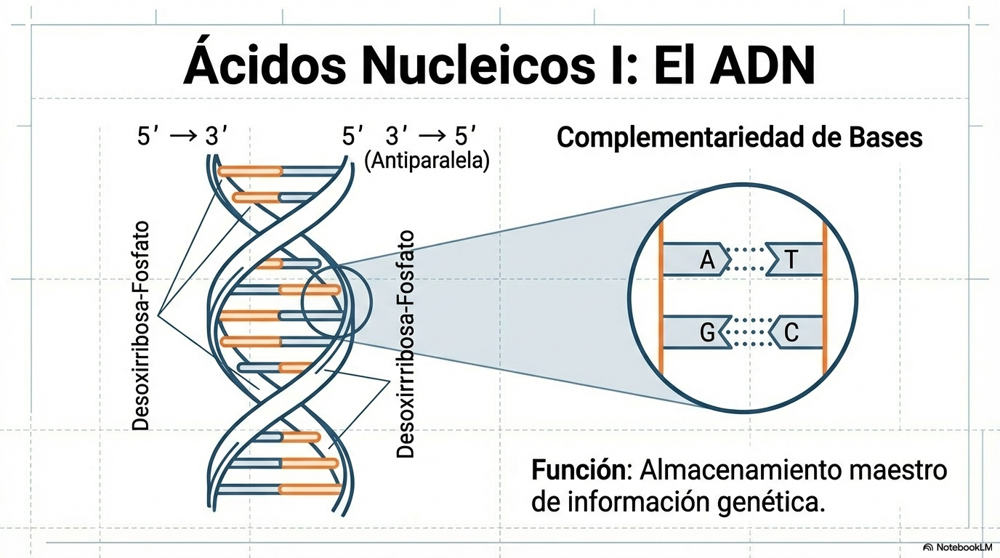{width="5.520958005249343in"}
:::

El ARN es monocatenario (una sola cadena), menos estable y actúa como intermediario para sintetizar proteínas a partir de la información genética recogida en el ADN. Existen tres tipos principales:

- ARNm, ARN mensajero, sintetizado a partir del ADN mediante la **replicación**, lleva el mensaje del núcleo al citoplasma donde están los ribosomas.

- ARNr, ARN ribosómico, forma los ribosomas que **traducen** el ARNm en proteínas.

- ARNt, ARN transferente, transporta los aminoácidos al ribosoma para la síntesis de proteínas mediante la **traducción**.

::: {style="text-align:center;"}
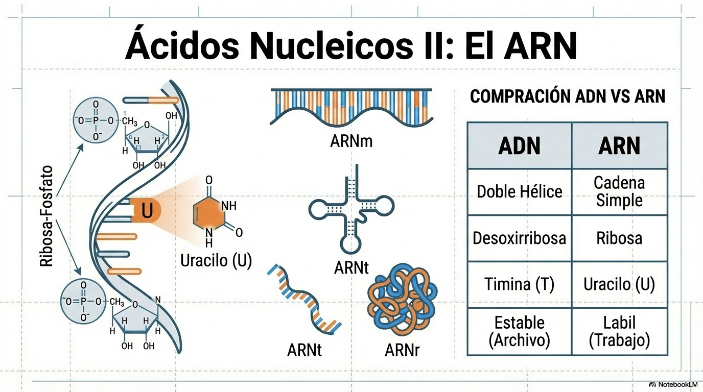{width="5.441674321959755in"}
:::

# 7. Salud y Estilos de Vida Saludables

Existe una relación directa entre el aporte equilibrado de bioelementos y la salud.

- **Nutrición:** La ingesta de ácidos grasos esenciales (como el linoleico), vitaminas y sales minerales previene trastornos metabólicos.

- **Homeostasis:** El mantenimiento de niveles adecuados de biomoléculas y el control del pH mediante sistemas tampón son pilares de un organismo sano.
