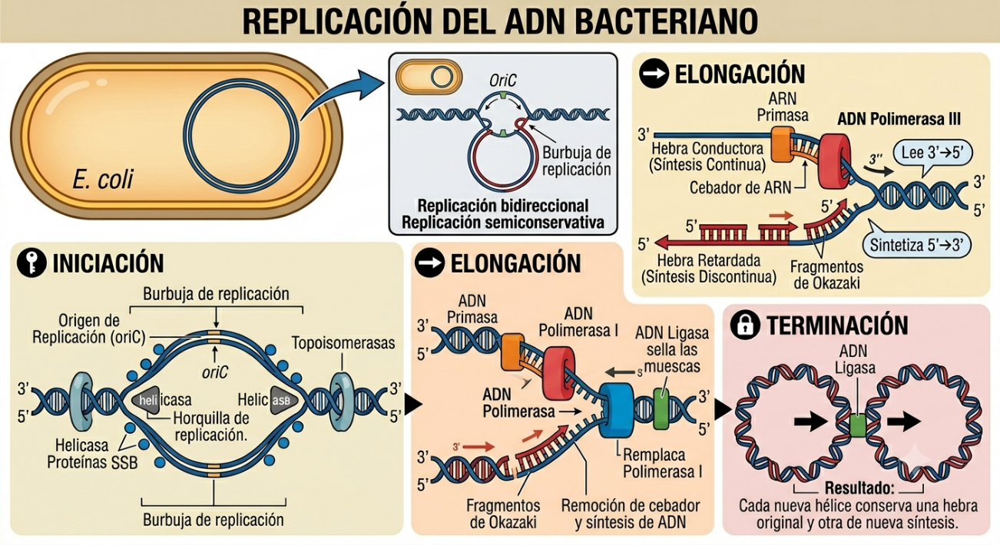
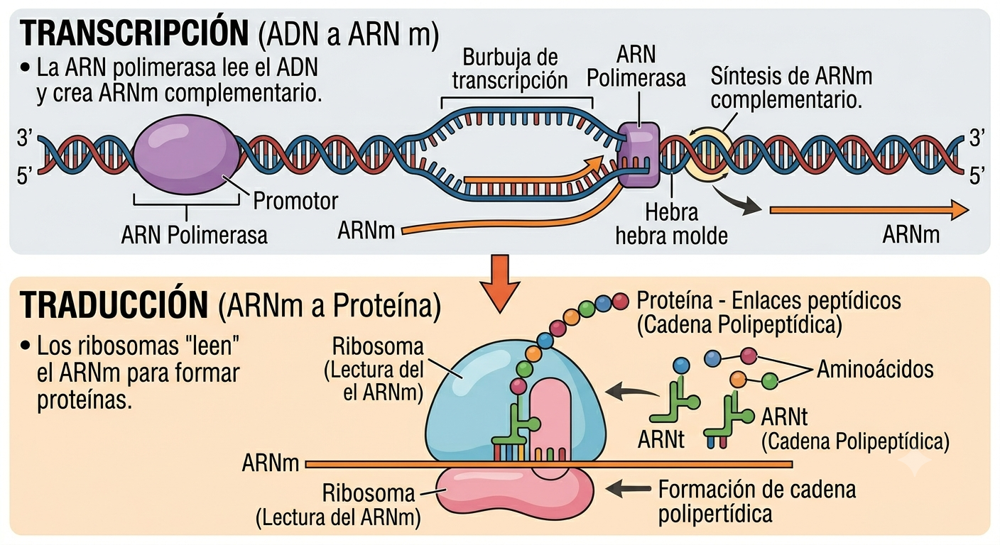
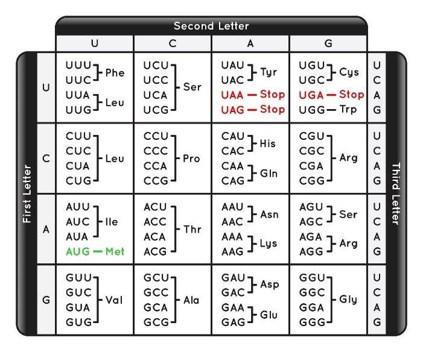
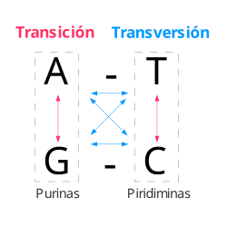
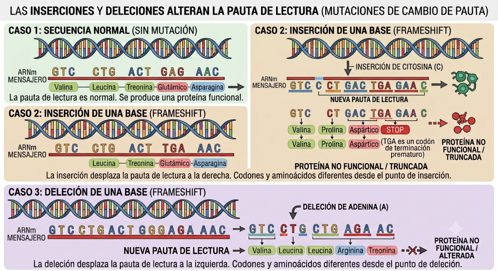
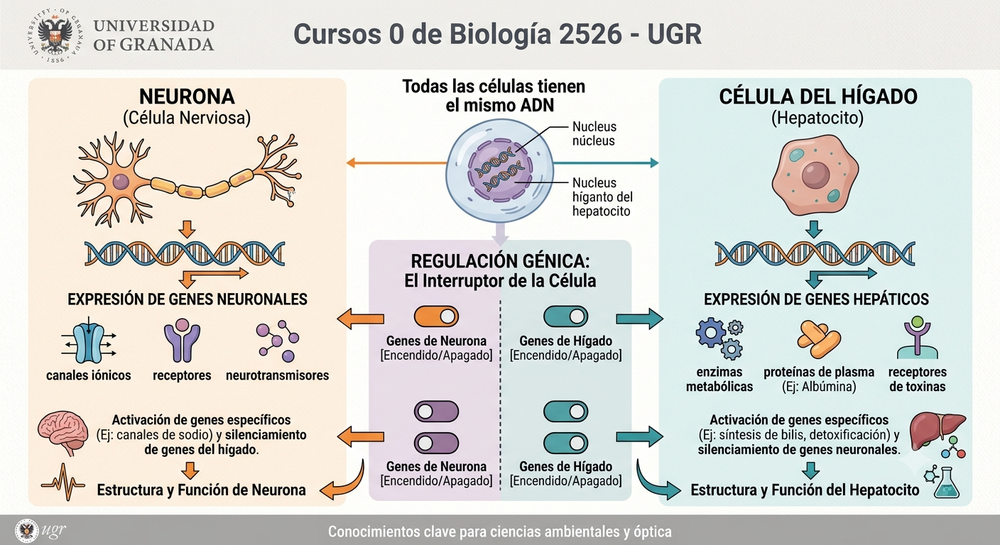

# 1. Mecanismo de replicación del ADN: modelo procariota

La replicación es el proceso por el cual una célula copia su ADN antes de dividirse, asegurando que las células hijas reciban la misma información genética. Es un proceso semiconservativo (cada nueva doble hélice conserva una hebra original y otra de nueva síntesis) y bidireccional. En las bacterias (procariotas), ocurre en el citoplasma.

Las fases de la replicación son tres:

::: {style="text-align:center;"}
{width="5.905555555555556in"}
:::

1. **Iniciación:** El proceso comienza en una secuencia nucleotídica específica del ADN circular llamada origen de replicación (*oriC*). La enzima helicasa rompe los puentes de hidrógeno que mantienen unida a las dos hebras del ADN, separándolas. Las proteínas SSB (proteínas ligantes de ADN de cadena sencilla) se unen a las hebras separadas impidiendo que se vuelvan a unir. Por último, unas enzimas denominadas topoisomerasas cortan y reconectan las cadenas de ADN para liberar la tensión espacial generada en este proceso.

2. **Elongación:**  La ARN primasa sintetiza un pequeño fragmento de ARN llamado cebador (o *primer*), necesario porque la enzima principal que crea la nueva hebra, la ADN polimerasa III, solo puede añadir nucleótidos a una doble cadena preexistente. Esta polimerasa lee la hebra molde en dirección 3\' →5\' y sintetiza la nueva en dirección 5\' →3\'. Debido al anti-paralelismo del ADN, una hebra se sintetiza de forma continua (hebra conductora), mientras que la otra (hebra retardada) se sintetiza a trozos llamados fragmentos de Okazaki.

3. **Terminación:** La ADN polimerasa I elimina los cebadores de ARN y los rellena con ADN. Finalmente, la ADN ligasa une todos los fragmentos (sellando las "mellas"), creando así una cadena continua.

Para una explicación visual y detallada del proceso, puedes consultar el recurso interactivo de [Khan Academy](https://es.khanacademy.org/science/ap-biology/gene-expression-and-regulation/replication/a/molecular-mechanism-of-dna-replication) o consultar los fundamentos teóricos en [Genotipia](https://genotipia.com/replicacion-del-adn/)

# 2. Etapas de la expresión génica: modelo procariota. El código genético

La expresión génica es el proceso mediante el cual la información del ADN se convierte en un producto génico final, que usualmente son proteínas, las verdaderas \"obreras\" de la célula. Esto siempre se ha resumido en el Dogma Central de la Biología Molecular: ADN → ARN → Proteína. En procariotas, como no hay núcleo, ambos procesos ocurren simultáneamente en el citoplasma.

[1. Transcripción (ADN a ARN mensajero)]{.underline}

La ARN polimerasa se une a una región del ADN llamada promotor. Abre la doble hélice y comienza a sintetizar una cadena de ARN mensajero (ARNm) complementaria a una de las hebras del ADN. Al llegar a una secuencia de terminación, el ARNm se libera.

[2. Traducción (ARNm a Proteína)]{.underline}

Los ribosomas son grandes moléculas (ribonucleoproteínas) que tienen la capacidad de "leer" la secuencia de nucleótidos del ARNm. El ARN de transferencia (ARNt) transporta los aminoácidos específicos al ribosoma, une estos aminoácidos mediante enlaces peptídicos, formando así una cadena polipeptídica o una proteína. Una cadena polipeptídica es una secuencia lineal de aminoácidos, mientras que una proteína es una molécula compleja formada por una o más cadenas polipeptídicas que adoptan una estructura tridimensional y funcional específica[.]{.mark}

::: {style="text-align:center;"}
{width="6.627699037620298in"}
:::

El código genético es el \"diccionario\" que traduce el lenguaje de los nucleótidos del ARN al de los aminoácidos de las proteínas. Se lee en tripletes (grupos de tres bases contiguas llamados codones.

::: {style="text-align:center;"}
{width="3.183827646544182in"}
:::

**Resolución de problemas:** Si os dan una secuencia de ADN (ej. 3\'-TAC-CGA-5\'), primero debéis transcribirla a ARNm respetando la complementariedad de bases y cambiando la Timina por Uracilo (5\'-AUG-GCU-3\'). Luego, consultando la tabla del código genético, se busca a qué aminoácido corresponde cada codón (AUG = Metionina, GCU = Alanina).

# 3. Las mutaciones: su relación con la replicación del ADN, la evolución y la biodiversidad

Una mutación es cualquier alteración permanente en la secuencia de nucleótidos del ADN. Aunque a veces asociamos \"mutación\" con enfermedad, biológicamente son la base o el motor de la evolución y de la adaptación a la vida. La mayoría de las mutaciones naturales ocurren por errores espontáneos durante la replicación del ADN. La ADN polimerasa a veces se equivoca al insertar un nucleótido. Aunque tiene mecanismos de corrección de errores, no es infalible. Agentes externos (radiación UV, sustancias químicas) también pueden provocar daños en el ADN.

Los tres tipos de errores en la replicación más frecuentes son:

- Sustituciones de bases. Una transición intercambia una purina por otra (A-G) o pirimidina por pirimidina (T-C), siendo más frecuentes y en general sin efecto. Una transversión cambia una purina por una pirimidina (ej. A-T o A-T), alterando la estructura química del par de bases. Son menos frecuentes pero suelen provocar un efecto en el organismo.

::: {style="text-align:center;"}
{width="2.341666666666667in"} 
:::

- Las [mutaciones de cambio de fase](https://es.wikipedia.org/wiki/Mutaciones_de_cambio_de_fase) o pauta de lectura: se trata de inserciones o deleciones de uno o muy pocos nucleótidos (distintos de tres o sus múltiplos). Dado que el código genético se lee en grupos de tres bases (codones) que determinan un aminoácido específico, al no ser múltiplo de tres, esta mutación altera completamente el orden de lectura 

- Deleciones y duplicaciones grandes: las deleciones y duplicaciones de regiones relativamente grandes también se han detectado con bastante frecuencia en regiones con secuencias repetidas.

> ::: {style="text-align:center;"}
{width="5.424896106736658in"}
:::

Las mutaciones son la fuente primaria de variabilidad genética. Generan nuevos alelos (versiones diferentes de un gen). Si una mutación ocurre en las células germinales (las que forman los gametos), se transmite a la descendencia. Sobre esta variabilidad actúa la **selección natural**: las mutaciones ventajosas ayudarán al organismo a sobrevivir y reproducirse, extendiéndose en la población y generando biodiversidad a lo largo del tiempo. Esta es la base de la Teoría de la evolución por selección natural de Darwin.

# 4. Regulación de la expresión génica: su importancia en la diferenciación celular

En los organismos pluricelulares, como los animales, generalmente todas las células del cuerpo presentan el mismo contenido en cromosomas y genes de su especie (ADN). Sin embargo, una célula determinada no necesita expresar todos esos genes, o producir todas sus proteínas funcionales durante todo el tiempo. Fabricar proteínas consume mucha energía, por lo que los organismos han desarrollado sistemas para \"encender\" o \"apagar\" genes según las necesidades del ambiente. De hecho, una célula es lo que es gracias al conjunto de genes que expresa.

En el caso de procariotas el sistema más conocido es el **Operón**. Un operón es un grupo de genes que se transcriben juntos bajo el control de un único promotor y una región reguladora (el operador). El ejemplo clásico es el *Operón Lac* en *E. coli*: las bacterias solo encienden los genes para digerir la lactosa si hay lactosa en el medio y no hay glucosa disponible. En eucariotas esta regulación puede ser mucho más compleja si consideramos a los organismos pluricelulares.

- **Importancia en la diferenciación celular:** Aunque esto es clave en eucariotas pluricelulares, el concepto es fundamental. Todas las células de un cuerpo humano (una neurona y una célula del hígado) tienen exactamente el mismo ADN. Lo que las hace diferentes (diferenciación celular) es la regulación génica: qué genes están encendidos y cuáles están apagados, determinando la función y forma específica de cada tipo celular. Una neurona es una célula que expresa genes de proteínas de neurona, mientras que una célula del hígado, expresa genes que darán lugar a proteínas propias del hígado

::: {style="text-align:center;"}
{width="5.90625in"}
:::

# 5. Los genomas procariota y eucariota: características generales y diferencias

Para entenderlo de forma sencilla, el genoma es el conjunto completo de material genético (ADN) que contiene las instrucciones necesarias para que un organismo se desarrolle, funcione y se reproduzca.

Dependiendo del tipo de organización celular de los seres vivos, nos encontramos con dos grandes tipos de genomas: el procariota (bacterias y arqueas) y el eucariota (animales, plantas, hongos y protozoos).

[1. El Genoma Procariota (El modelo eficiente y compacto)]{.underline}

Las células procariotas son evolutivamente más antiguas y estructuralmente más simples. Su genoma refleja esta sencillez:

- Localización: No tienen un núcleo definido. El ADN se encuentra libre en una región del citoplasma llamada nucleoide.

- Estructura principal: Consiste en una sola molécula de ADN circular y bicatenaria (de dos hebras). Se le suele llamar \"el cromosoma bacteriano\".

- ADN extracromosómico (Plásmidos): Además del cromosoma principal, las bacterias suelen tener pequeños anillos de ADN independientes llamados plásmidos. Estos contienen genes \"extra\" muy útiles, como los que les otorgan resistencia a los antibióticos.

- Empaquetamiento: El ADN no está asociado a proteínas histonas (está \"desnudo\" o asociado a proteínas de tipo no histona), y se pliega gracias a un superenrollamiento.

- Organización: Es sumamente eficiente. Casi todo el ADN codifica para proteínas (apenas hay \"paja\" o secuencias repetitivas). Los genes se organizan en operones (grupos de genes que se expresan todos juntos).

[2. El Genoma Eucariota (El modelo complejo y regulado)]{.underline}

Las células eucariotas (las tuyas, las de una planta o un hongo) son más complejas, grandes y compartimentadas. Su genoma es significativamente mayor y más sofisticado:

- Localización: El ADN está protegido dentro de un compartimento específico: el núcleo celular. (Nota universitaria: también hay pequeños genomas circulares dentro de las *mitocondrias* y los *cloroplastos*, herencia de su pasado bacteriano).

- Estructura principal: El ADN es lineal y bicatenario, y está fragmentado en múltiples moléculas. Cuando la célula se va a dividir, estas moléculas se condensan formando los cromosomas (el número varía según la especie; los humanos tenemos 46).

- Empaquetamiento: El ADN eucariota es larguísimo. Para que quepa en el núcleo, se enrolla fuertemente alrededor de unas proteínas llamadas histonas, formando una estructura similar a un collar de perlas llamada cromatina.

- Organización y \"ADN no codificante\": A diferencia del procariota, el genoma eucariota contiene una enorme cantidad de ADN que no codifica directamente para proteínas (antiguamente llamado \"ADN basura\", hoy sabemos que es vital para regular la expresión de los genes). Además, los genes individuales están fragmentados en zonas que se expresan (exones) y zonas intermedias que se eliminan (intrones).

  ----------------------------------------------------------------------------------------------------------------
  **Característica**          **Genoma Procariota**              **Genoma Eucariota**
  --------------------------- ---------------------------------- -------------------------------------------------
  **Localización**            Citoplasma (Nucleoide)             Núcleo celular (y en mitocondrias/cloroplastos)

  **Forma del ADN**           Circular                           Lineal

  **Número de moléculas**     Única (Un solo cromosoma)          Múltiples cromosomas

  **Asociación a Histonas**   No (ADN \"desnudo\")               Sí (Forma la cromatina)

  **Plásmidos**               Frecuentes                         Muy raros (salvo en levaduras)

  **Estructura del gen**      Continua (sin intrones)            Fragmentada (Intrones y Exones)

  **Eficiencia**              Muy alta (apenas ADN repetitivo)   Menor densidad génica (mucho ADN regulador)
  ----------------------------------------------------------------------------------------------------------------
