# 1. La Membrana Plasmática: Ultraestructura y Propiedades

La membrana plasmática no es una pared rígida, sino una estructura dinámica y fluida descrita en los años 70 por el **Modelo del Mosaico Fluido** por Singer y Nicolson. Este modelo resulta útil como modelo conceptual de base para entender el funcionamiento de la membrana plasmática, aunque desde entonces se han propuesto cambios que modifican ligeramente el modelo inicial en varios aspectos.

::: {style="text-align:center;"}
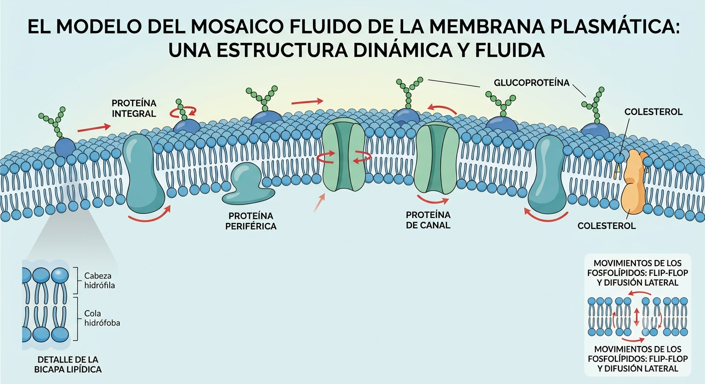
:::

### I.  Composición de la membrana

- **Bicapa lipídica:** Formada por fosfolípidos (anfipáticos: cabeza hidrófila y colas hidrófobas).

- **Colesterol:** Intercalado entre los fosfolípidos; regula la fluidez de la membrana.

- **Proteínas:** Pueden ser *integrales* (cruzan la membrana) o *periféricas* (en las caras interna o externa). Actúan como canales, bombas o receptores.

- **Glúcidos:** Unidos a lípidos o proteínas en la cara externa formando el **glucocálix** (reconocimiento celular).

### II. Propiedades

Debemos ver la membrana plasmática no como una frontera rígida, sino como una estructura asombrosamente inteligente y dinámica. Sus propiedades físico-químicas derivan directamente de su composición (recuerda: esa bicapa de fosfolípidos con proteínas y colesterol interpuestos). 

Vamos a desglosar las cuatro propiedades fundamentales que debes dominar:

1. Fluidez: El secreto del \"Mosaico Fluido\" La membrana no es estática; se comporta como un líquido bidimensional. 

2. Permeabilidad Selectiva (Semipermeabilidad): La membrana es extremadamente delicada con lo que deja pasar. Debido a que el interior de la bicapa es totalmente hidrófobo (graso), actúa como una barrera infranqueable para la mayoría de las sustancias polares o con carga eléctrica. 

::: {style="text-align:center;"}
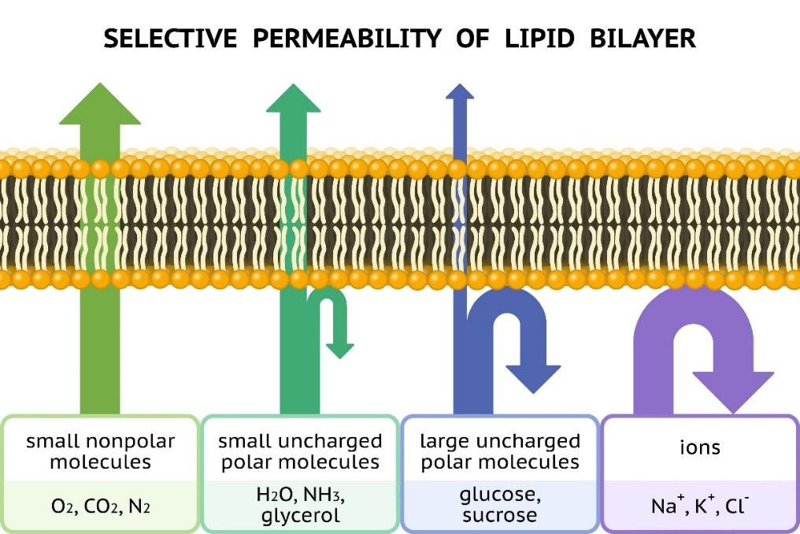{width="4.595997375328084in"}
:::

3. Asimetría: Las dos caras de la membrana (la que mira al exterior de la célula y la que mira al citoplasma) no son iguales. Tienen composiciones distintas porque cumplen funciones diferentes. 

4. Capacidad de Autosellado (Resiliencia Lipídica): Si perforamos una célula con una micro aguja, la membrana no estalla como un globo. Debido al efecto hidrófobo, las colas de los fosfolípidos huyen del agua del entorno de forma natural. 

# 2. El Proceso Osmótico 

La membrana plasmática actúa como una membrana semipermeable, pudiendo generar fenómenos osmóticos que son esenciales para la vida.

La ósmosis es el movimiento pasivo de agua a través de una membrana semipermeable desde un medio **hipotónico** (baja concentración de solutos) hacia uno **hipertónico** (alta concentración de solutos) hasta equilibrar las concentraciones (medio **isotónico**). Su repercusión es vital para las células.

Someter a las células a estos medios puede producir muchos fenómenos, según el tipo celular que lo sufra:

En la **Célula Animal**, al no tener una cápsula rígida externa (pared celular), su membrana podrá "inflarse" como un balón o "desinflarse" como una pasa.

- *Medio hipotónico:* El agua entra masivamente y estalla (**lisis celular**).

- *Medio hipertónico:* El agua sale y la célula se arruga como una pasa (**crenación**).

En la **Célula Vegetal**, que sí presenta una cápsula rígida externa (pared celular rígida)**:**

- *Medio hipotónico:* El agua entra, la vacuola se hincha y empuja contra la pared (**turgencia**). La célula no estalla gracias a la pared.

- *Medio hipertónico:* El agua sale, el citoplasma se reduce y la membrana se despega de la pared (**plasmólisis**) quedando unida a la pared por la zona de plasmodesmos.

En la **Célula Procariota (Bacterias con pared bacteriana):**

- Comportamiento similar a la vegetal; su pared de peptidoglicano previene la lisis en medios hipotónicos.

::: {style="text-align:center;"}
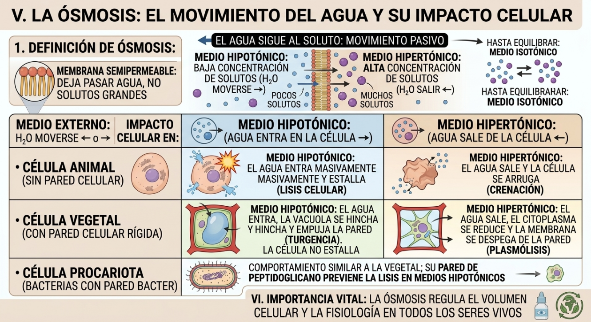{width="6.111979440069991in"}
:::

# 3. Mecanismos de Transporte a través de la Membrana

Podemos dividir el transporte a través de la membrana según el gasto energético:

- A. Transporte Pasivo (A favor de gradiente, NO consume ATP)

  - **Difusión simple:** Moléculas pequeñas y apolares (gases como O2 y CO2, o el etanol) cruzan directamente la bicapa lipídica.

  - **Difusión facilitada:** Moléculas polares o cargadas (glucosa, aminoácidos, iones como Na+ o Cl-) que no pueden cruzar la capa lipídica y necesitan la ayuda de **proteínas de canal** o **proteínas transportadoras (*carriers*)**.

- B. Transporte Activo (En contra de gradiente, SÍ consume ATP)

  - **Bombas de transporte activo:** Proteínas que fuerzan el paso de sustancias donde ya hay mucha concentración. El ejemplo estrella de la fisiología es la **Bomba de Sodio-Potasio (Na+/K+)**. Estas proteínas bombean iones desde una localización hacia otra donde ya existe una elevada concentración de esos iones, por ello necesitan energía para funcionar.

Además, también se puede generar transporte mediante vesículas membranosas:

- **Endocitosis:** La membrana se invagina para introducir grandes partículas. Puede ser *pinocitosis* (líquidos) o *fagocitosis* (sólidos grandes, como una bacteria ingerida por un macrófago). De esta forma se pueden capturar moléculas o estructuras complejas del exterior,

- **Exocitosis:** Vesículas internas se fusionan con la membrana para expulsar desechos o secretar sustancias (como hormonas). Cuando la célula quiere deshacerse de algo.

# 4. Orgánulos Celulares y sus Funciones Básicas

El interior celular está compuesto de diferentes elementos según el tipo de célula que consideremos. Indicamos a continuación de forma resumida los componentes principales que se encuentran en las células de los grandes reinos y la función principal que ejercen.

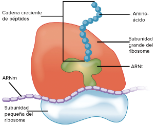
Los **ribosomas** son los responsables de la síntesis de proteínas. Son complejos macromoleculares (ribonucleoproteínas) que se encuentran en el citoplasma, en las mitocondrias, cloroplastos y asociados al retículo endoplasmático.
 

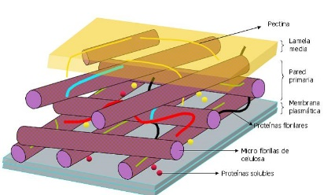
La **pared celular** se encuentra exclusivamente en las células vegetales, en bacterias o arqueas y también en hongos. Es siempre una estructura rígida y estable, que rodea a la célula aportándole rigidez y protección osmótica. Estructuralmente se compone usualmente de polímeros de azúcares junto a otras moléculas que les dan propiedades específicas a la pared. Por ejemplo, las ligninas y peptinas que acompañan al polímero de glucosa en la pared celular de las plantas superiores constituyen nuestras maderas.
 

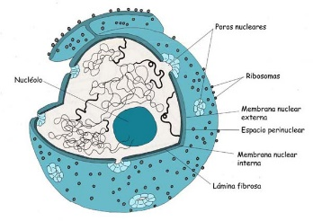
El **núcleo** contiene toda la información genética. Esta limitado por la envoltura nuclear (doble membrana lipídica). En la envoltura nuclear se encuentra el complejo del poro, que como su nombre indica actúa como una puerta selectiva de comunicación entre el interior del núcleo y el citoplasma.
 

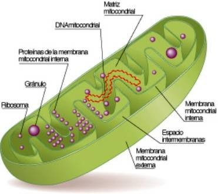
Las **mitocondrias** son orgánulos rodeados de dos membranas diferentes en sus funciones, que delimitan dos espacios en el interior del orgánulo: el espacio intermembranoso y la matriz mitocondrial. La membrana externa lisa y permeable a iones y metabolitos, y la membrana mitocondrial interna altamente selectiva y replegada en las crestas mitocondriales. La matriz mitocondrial contiene ADN circular y ribosomas mitocondriales. Su función principal es la obtención de energía (ciclo de Krebs, beta oxidación de ácidos grasos.
 

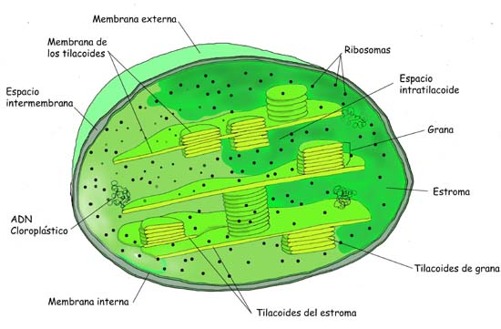
Los **plastos** son orgánulos que presentan igualmente doble membrana. Se encuentran en las plantas y algas. En el espacio interno (estroma) pueden contener otras membranas (tilacoides). Presentan ADN circular y ribosomas (plastoribosomas). Su función principal depende del tipo de plasto. El más conocido es el cloroplasto cuya función principal es la fotosíntesis.
 

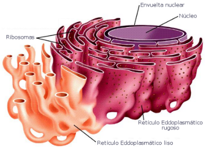
El **retículo endoplasmático** está constituido por túbulos o cisternas membranosas interconectadas entre sí, que se pueden distribuir por todo el citoplasma. Se pueden asociar externamente con ribosomas, denominándose entonces retículo endosplamático rugoso (RER), cuya función es la síntesis de proteínas de membrana o secreción. Si no se asocia a ribosomas hablamos de **retículo endpoplasmático liso (REL)**, que participa en la síntesis de lípidos, la detoxificación celular, la gluconeogénesis (síntesis de glucosa) o el almacenamiento de calcio.
 

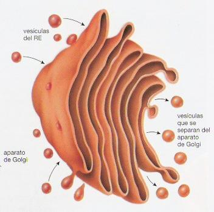
El **aparato de Golgi** es un orgánulo constituido por membranas aplanadas (cisternas) y vesículas. Las cisternas o sáculos se agrupan en paralelo en paquetes y junto a sus vesíclas funcionan como una planta empaquetadora y etiquetadora de lípidos y proteínas. Usualmente se conecta y asocia a las membranas del retículo.
 

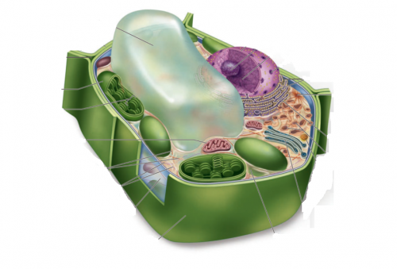
Las **vacuolas** son compartimentos limitados una membrana (tonoplasto), presente en las células de plantas, y en algunas células procariotas. Contienen diferentes fluidos, como agua o enzimas, aunque en algunos casos puede contener sólidos, por ejemplo azúcares, sales, proteínas y otros nutrientes. Sus funciones son muy variables.
 

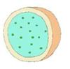
Los **lisosomas** son estructuras típicamente esféricas rodeadas por membrana con unas características especiales. Encierra a enzimas capaces de lisar las moléculas orgánicas y se encargan de la digestión celular. Contienen enzimas hidrolíticas y proteolíticas que sirven para digerir los materiales de origen externo (heterofagia) o interno (autofagia) que llegan a ellos.
 

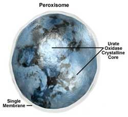
Los **peroxisomas** son también vesículas membranosas que contienen enzimas oxidasas y catalasas. Intervienen en el metabolismo lipídico y contienen enzimas que oxidan los aminoácidos. Participan también en la detoxificación. Generan agua oxigenada.
 

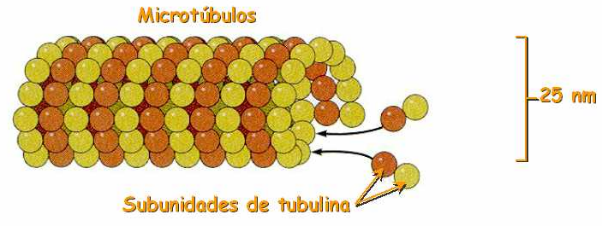
El **citoesqueleto** es el conjunto de filamentos proteicos que forman un entramado dinámico que se extienden a través del citoplasma y del núcleo. Las funciones del citoesqueteto son diversas: interviene en la organización interna celular, en la movilidad, en la división de la célula, etc. Exten tres tipos: filamentos de actina, microtúbulos y filamentos intermedios.
 