# 1. El Ciclo Celular: interfase y mitosis

El ciclo celular es la \"vida\" de una célula desde que "nace" o surge como una entidad independiente hasta que se divide para dar lugar a dos células hijas. Podemos diferenciar claramente dos etapas en el ciclo vida de las células, el periodo en el que la célula no se divide, la **interfase** y el momento en el que lo hace, la fase **mitótica o mitosis.**

## 1.1. La interfase

Implica el ciclo de la vida de una célula durante el cual no se da división celular. Está, al mismo tiempo está dividida en tres etapas consecutivas y funcionalmente diferentes. La fase G1, la S (Síntesis) y la G2. En ocasiones, además, algunas células pueden entrar en una fase alternativa denominada G0 (fase de quiescencia), siempre tras la fase G1. Las células que entran en G0, también conocidas como células quiescentes, abandona el curso normal del ciclo y no se dividen más. Son células muy diferenciadas. En la siguiente tabla se describen las propiedades de cada una de esas etapas.

<table class="interfase-table">
  <thead>
    <tr>
      <th style="text-align: center; vertical-align: middle;">Etapa</th>
      <th style="text-align: center; vertical-align: middle;">Eventos celulares asociados</th>
      <th style="text-align: center; vertical-align: middle;">Esquema representativo</th>
    </tr>
  </thead>
  <tbody>
    <tr>
      <td><strong>G1</strong></td>
      <td>Las células crecen de tamaño y realiza sus funciones metabólicas normales.</td>
      <td rowspan="4" style="text-align: center; vertical-align: middle;">
        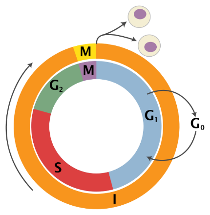
      </td>
    </tr>
    <tr>
      <td><strong>S</strong></td>
      <td>Se produce la replicación o duplicación del material hereditario (ADN). Cada molécula de ADN genera una copia idéntica de sí mismo.</td>
    </tr>
    <tr>
      <td><strong>G2</strong></td>
      <td>Las células siguen creciendo y se aseguran de que todo está listo para la división celular. se sintetizan las proteínas necesarias para la división celular.</td>
    </tr>
    <tr>
      <td><strong>G0</strong></td>
      <td>En células fuertemente diferenciadas (P. ej. Neuronas)</td>
    </tr>
  </tbody>
</table>

## 1.2.  La fase mitótica o de división

En esta parte del ciclo ocurre la división del núcleo o mitosis y la citocinesis (división del citoplasma). Es la parte del ciclo celular donde la célula se divide para dar lugar a dos células hijas genéticamente similares a la célula que las originó. La mitosis es generalmente es una fase muy corta respecto a la interfase. Las etapas de la mitosis (cuatro) se describen en la siguiente tabla:

<table class="mitosis-table">
  <thead>
    <tr>
      <th>Profase</th>
      <th>Metafase</th>
      <th>Anafase</th>
      <th>Telofase</th>
    </tr>
  </thead>
  <tbody>
    <tr>
      <td style="text-align: center; vertical-align: middle;">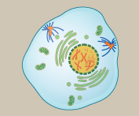</td>
      <td style="text-align: center; vertical-align: middle;">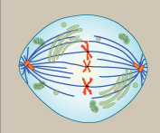</td>
      <td style="text-align: center; vertical-align: middle;">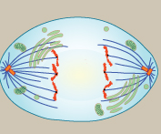</td>
      <td style="text-align: center; vertical-align: middle;">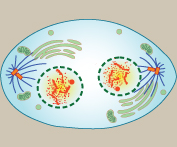</td>
    </tr>
    <tr>
      <td style="text-align: left;">1. Los cromosomas se condensan y se hacen visibles</td>
      <td style="text-align: left;">1. Las fibras del huso se unen al centrómero de los cromosomas</td>
      <td style="text-align: left;">1. Las cromátidas hermanas se separan a nivel del centrómero</td>
      <td style="text-align: left;">1. Las cromátidas hermanas llegan a polos opuestos de la célula</td>
    </tr>
    <tr>
      <td style="text-align: left;">2. El huso mitótico emerge desde los centrosomas</td>
      <td style="text-align: left;">2. Cada cromátida hermana se une a una fibra del huso de cada polo</td>
      <td style="text-align: left;">2. Las cromátidas hermanas son separadas hacia diferentes polos por acción del huso</td>
      <td style="text-align: left;">2. Los cromosomas empiezan a descondensarse</td>
    </tr>
    <tr>
      <td style="text-align: left;">3. Las envolturas nucleares se desintegran</td>
      <td style="text-align: left;">3. Los cromosomas se ordenan formando la placa metafásica</td>
      <td style="text-align: left;">3. Ciertas fibras del huso comienzan a elongar la célula</td>
      <td style="text-align: left;">3. Comienza a formarse las nuevas envolturas nucleares</td>
    </tr>
    <tr>
      <td style="text-align: center; vertical-align: middle;">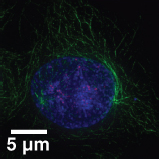</td>
      <td style="text-align: center; vertical-align: middle;">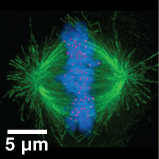</td>
      <td style="text-align: center; vertical-align: middle;">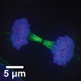</td>
      <td style="text-align: center; vertical-align: middle;">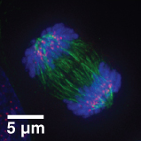</td>
    </tr>
  </tbody>
</table>

## 1.3.  Regulación del ciclo celular

El ciclo celular está estrictamente regulado por un grupo de proteínas llamadas **ciclinas** y **quinasas dependientes de ciclinas (CDK)**. A lo largo del ciclo existen \"puntos de control\" (*checkpoints*), en G1/S y G2/M donde la célula comprueba si el ADN está intacto antes de continuar.

# 2. La Meiosis: Fases y Función Biológica

Las **células destinadas a formar gametos**, las células de la línea germinal (óvulos y espermatozoides) experimentan un tipo de división celular especial conocido como meiosis.

En la meiosis, contrariamente a la mitosis, las células hijas **serán genéticamente diferentes** a la célula que las originó por dos razones principales. Por un lado, durante la meiosis **se producirá la reducción del material hereditario a la mitad**. A partir de una célula diploide (2n), tras la mitosis, se generan dos células haploides (n). En la especia humana, de 46 cromosomas pasamos a 23. Por otro, durante la meiosis se produce un intercambio de alelos entre cromátidas hermanas. Cada par homólogo de cromosoma se empareja formando bivalentes, que permitien que se produzca la recombinación entre ambos cromosomas homólogos. De esta forma se originan cromosomas con una composición alélica diferente a los cromosomas originarios, es decir, con variabilidad genética.

## 2.1. Etapas de la meiosis

La meiosis se lleva a cabo en dos divisiones nucleares y citoplasmáticas consecutivas, llamadas primera y segunda división meiótica o simplemente meiosis I y meiosis II. Ambas comprenden profase, metafase, anafase y telofase. La meiosis I se describe en la imagen inferior

::: {style="text-align:center;"}
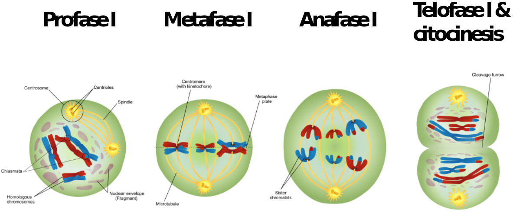{width="6.256698381452319in"}
:::

**Particularidades de la Profase I** de la primera división meiótica.

Es la etapa más compleja del proceso ya que durante esta etapa se lleva a cabo la recombinación. Se divide en 5 etapas, que son:

- *[Leptotene:]{.underline}* Los cromosomas se empiezan a condensar

- *[Zigotene]{.underline}:* Los cromosomas homólogos (paterno y materno) se aparean, y al complejo resultante de cada par cromosómico se le conoce como bivalente o tétrada

- *[Paquitene:]{.underline}* Se produce el fenómeno de entrecruzamiento cromosómico (crossing-over) en el cual las cromátidas homólogas no hermanas intercambian material genético. La recombinación genética resultante hace aumentar en gran medida la variación genética entre la descendencia de progenitores que se reproducen por vía sexual.

- *[Diplotene:]{.underline}* Los cromosomas continúan condensándose y ahora se pueden observar las dos cromátidas de cada cromosoma, y los lugares donde se ha producido la recombinación. Estas estructuras en forma de X reciben el nombre quiasmas, y representan un sitio de entrecruzamiento, lugar en el que anteriormente se rompieron dos cromátidas homólogas que intercambiaron material genético y se reunieron.

En este punto la meiosis puede sufrir una pausa, como ocurre en el caso de la formación de los óvulos humanos hacia el séptimo mes del desarrollo embrionario y su proceso de meiosis no continuará hasta alcanzar la madurez sexual. A este estado de latencia se le denomina [dictiotene]{.underline}.

- *[Diacinesis]{.underline}* Podemos observar los cromosomas algo más condensados y los quiasmas. Representa el final de la profase I meiótica y viene marcado por la rotura de la envoltura nuclear.

**Un aspecto diferenciador de la meiosis I es que durante la anafase, lo que se separa son los cromosomas homólogos y no las cromátidas hermanas.**

En la **profase II,** la división celular es similar a la de la mitosis, donde lo que se separara durante la anafase son las crómatidas de cada cromosoma. Además, en la profase ya partimos de cromosomas condensados. Se explica en la imagen inferior.

::: {style="text-align:center;"}
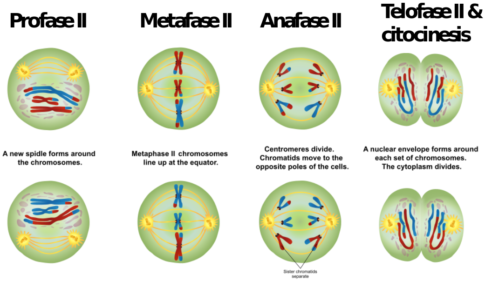{width="6.360565398075241in"}
:::

# 3. Sentido biológico de la meiosis

La **meiosis** no es una simple división celular; es un proceso celular clave para los organismos que se reproducen sexualmente. Su sentido biológico se sostiene sobre tres pilares fundamentales para la vida y la evolución:

## 3. 1. Conservación del número de cromosomas (Estabilidad)

La meiosis reduce a la mitad la cantidad de material genético, transformando células diploides (con dos juegos de cromosomas, **2n**) en gametos haploides (con un solo juego, **n**). Si no ocurriera esta reducción, la unión del óvulo y el espermatozoide duplicaría el número de cromosomas en cada nueva generación, haciendo inviable la vida. Gracias a la meiosis, la fecundación restablece el número cromosómico exacto de la especie.

## 3.2. Creación de variabilidad genética (Diversidad)

La meiosis es la gran \"mezcladora\" de la naturaleza. Asegura que cada gameto producido sea genéticamente único gracias a dos mecanismos:

- **Recombinación genética (sobrecruzamiento):** Durante la Profase I, los cromosomas homólogos (paterno y materno) se aparean e intercambian fragmentos de ADN físico. El resultado son cromosomas con combinaciones de genes totalmente nuevas.

- **Segregación independiente:** En la Anafase I, los cromosomas se separan y se distribuyen hacia los polos de la célula de manera completamente aleatoria.

## 3.3. Motor de la evolución y la adaptación

La diversidad genética que genera la meiosis hace que los descendientes sean parecidos a sus progenitores, pero nunca idénticos.

**La clave evolutiva:** Esta variedad es la materia prima sobre la que actúa la **selección natural**. Si el entorno cambia (por ejemplo, ante una nueva enfermedad o un cambio climático), una población genéticamente diversa tiene muchas más probabilidades de que algunos de sus miembros sobrevivan y perpetúen la especie.

En resumen, el sentido biológico de la meiosis es un equilibrio perfecto: garantiza la **estabilidad del genoma** de una especie a través de las generaciones, al mismo tiempo que aporta la **diversidad necesaria** para que la vida pueda adaptarse, cambiar y evolucionar.

# 4. Diferencias entre mitosis y meiosis

A continuación, tienes una tabla comparativa con las diferencias fundamentales entre la **mitosis** y la **meiosis**:

  -------------------------------------------------------------------------------------------------------------------------------------------------------------------------------------------------------------------
  **Característica**                  **Mitosis**                                                                                **Meiosis**
  ----------------------------------- ------------------------------------------------------------------------------------------ ------------------------------------------------------------------------------------
  **Tipo de células implicadas**      Células somáticas (células del cuerpo, como la piel o los músculos).                       Células germinales (las que darán origen a los gametos: óvulos y espermatozoides).

  **Número de divisiones**            **1 sola** división celular.                                                               **2 divisiones** sucesivas (Meiosis I y Meiosis II).

  **Número de células hijas**         Genera **2** células hijas.                                                                Genera **4** células hijas.

  **Ploidía de las células hijas**    **Diploides (2n):** Conservan el mismo número de cromosomas que la célula madre.           **Haploides (n):** Tienen la mitad de los cromosomas de la célula original.

  **Relación genética**               Las células hijas son **genéticamente idénticas** entre sí y a la célula madre (clones).   Las células hijas son **genéticamente diferentes** entre sí y a la célula madre.

  **Apareamiento de homólogos**       No ocurre. Los cromosomas homólogos actúan de forma independiente.                         Sí ocurre. Los cromosomas homólogos se aparean (sinapsis) durante la Profase I.

  **Recombinación (Crossing-over)**   **No existe** recombinación genética.                                                      **Sí existe** recombinación en la Profase I, lo que genera variabilidad.

  **Función biológica**               Crecimiento, renovación y reparación de tejidos; reproducción asexual.                     Producción de gametos para la reproducción sexual; motor de la evolución.
  -------------------------------------------------------------------------------------------------------------------------------------------------------------------------------------------------------------------

En resumen, mientras que la **mitosis** es un proceso de copia exacta para mantener el cuerpo funcionando y creciendo, la **meiosis** es un proceso de barajado y reducción genética diseñado específicamente para la reproducción y la diversidad de la especie.

# 5.  El Cáncer y Estilos de Vida

El cáncer es, en esencia, una enfermedad del ciclo celular. Ocurre cuando se acumulan **mutaciones** en el ADN que afectan a dos tipos de genes reguladores:

- Los **protooncogenes** (que estimulan la división celular) mutan a **oncogenes** (actúan como un acelerador atascado).

- Los **genes supresores de tumores** (como el gen *p53*, que frena el ciclo si hay fallos) se inactivan (actúan como unos frenos rotos).

**Como consecuencias,** la célula ignora los puntos de control, no realiza la apoptosis, y se divide de forma masiva y descontrolada formando tumores, pudiendo invadir otros tejidos (**metástasis**).

## Correlación con hábitos de vida

Aunque hay un componente genético incontrolable que predispone a sufrir diferentes procesos cancerígenos, la aparición de mutaciones está directamente ligada a factores ambientales y hábitos cotidianos (agentes carcinógenos):

- **Tabaquismo y Alcohol:** Contienen compuestos químicos que dañan directamente las bases nitrogenadas del ADN de las células pulmonares, digestivas, etc.

- **Radiación ultravioleta (UV):** Especialmente importante en los meses de más calor. La exposición solar sin protección altera el ADN celular (cataratas, melanomas).

- **Dieta inadecuada y sedentarismo:** Dietas ricas en ultraprocesados y grasas trans favorecen ambientes inflamatorios crónicos en el cuerpo que propician la proliferación celular anómala.

**Importancia de los estilos de vida saludables:** Evitar sustancias tóxicas, mantener una dieta rica en antioxidantes (frutas y verduras que ayudan a neutralizar los radicales libres que dañan el ADN) y realizar ejercicio físico regular reduce drásticamente la probabilidad estadística de sufrir alteraciones en los mecanismos del ciclo celular.
