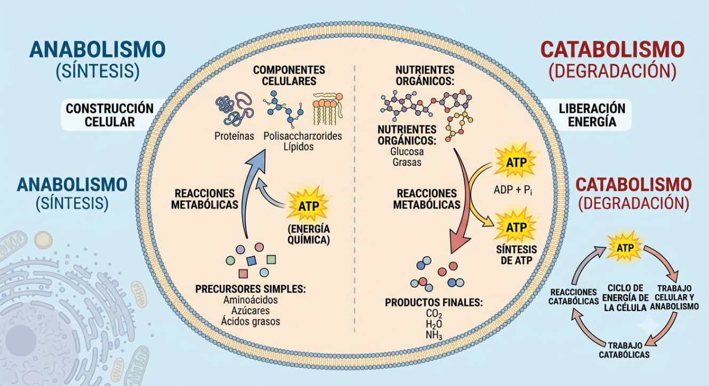
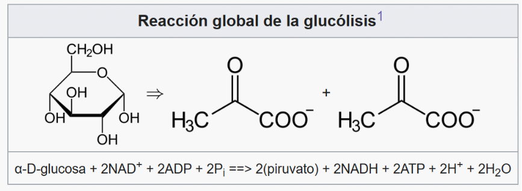
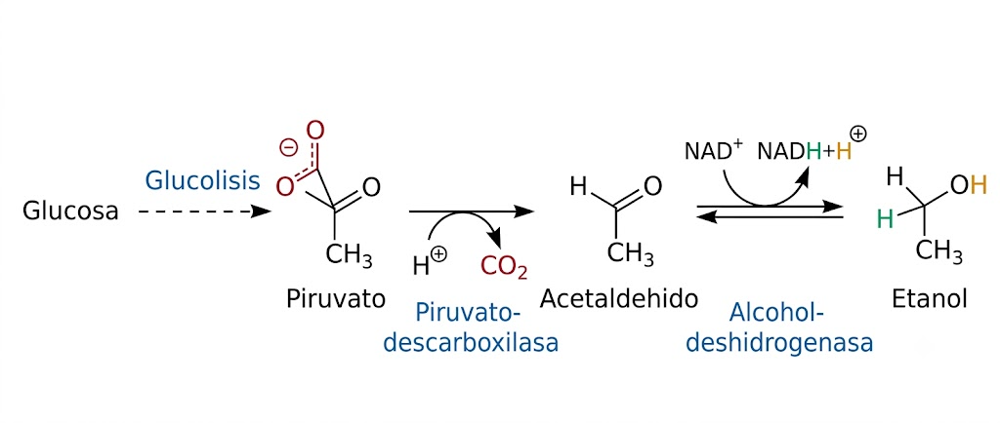
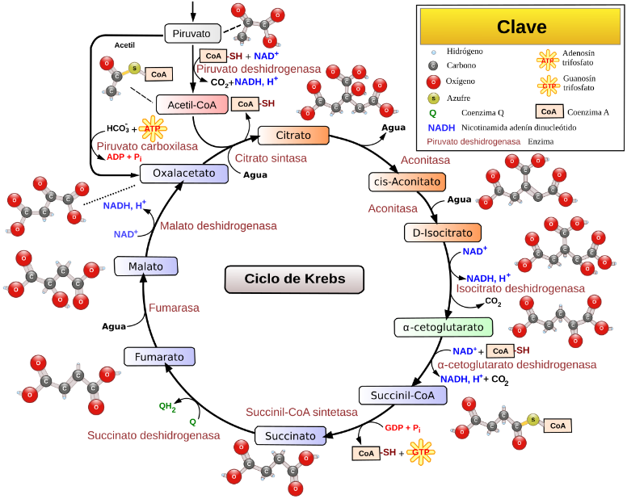
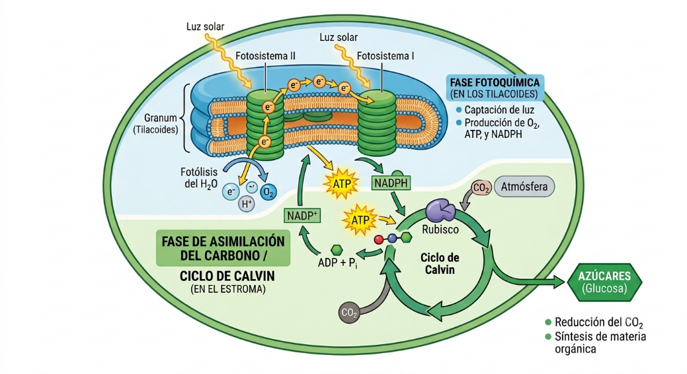
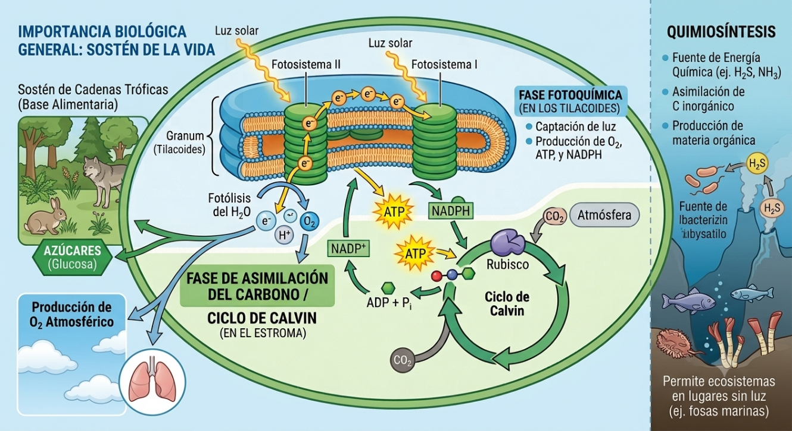

# 1. Concepto de Metabolismo

El **metabolismo** es el conjunto de todas las reacciones químicas interconectadas que ocurren en el interior de una célula. Estas reacciones no ocurren al azar, sino que están organizadas en **rutas metabólicas** (secuencias de pasos donde el producto de una reacción es el sustrato de la siguiente) y suelen estar catalizadas por **enzimas** (proteínas específicas que regulan las reacciones).

Su objetivo principal es doble: obtener energía útil para la célula (en forma de ATP) y fabricar sus propios componentes estructurales y funcionales, hablándose de catabolismo y anabolismo, respectivamente.

# 2. Anabolismo y Catabolismo: Diferencias

El metabolismo se divide en dos vertientes opuestas pero totalmente acopladas: anabolismo y catabolismo (@fig-metabolismo_celular).

El anabolismo (del griego ana 'hacia arriba', y ballein 'lanzar') es el conjunto de reacciones metabólicas que tienen por finalidad la síntesis de componentes celulares a partir de precursores de baja masa molecular, es decir reacciones metabólicas biosintéticas.

El catabolismo (del griego kato 'hacia abajo', y ballein 'lanzar') por tanto, es el conjunto de reacciones metabólicas que degradan los nutrientes orgánicos para transformarlos en productos finales más simples, con el fin de extraer de ellos energía química útil para la célula. La energía liberada por las reacciones catabólicas es usada en la síntesis de moléculas que almacenan la energía en sus enlaces. El ATP, se podría considerar la principal "moneda" energética de la célula.

::: {style="text-align:center;"}
{width="5.298700787401575in" #fig-metabolismo_celular}
:::

Aunque anabolismo y catabolismo son dos procesos funcionalmente contrarios, ambos trabajan de forma conjunta y armónica, y constituyen una unidad difícil de separar.

Desde el punto de vista químico, el anabolismo se constituye fundamentalmente por **reacciones reductoras de síntesis** que consumen energía (endergónicas). El catabolismo, se constituye de **reacciones oxidativas** **degradadoras** que liberan energía (exergónicas). Esta energía acopla usualmente a la síntesis de ATP (@fig-metabolismo_celular).

# 3. Procesos de la Respiración Celular Anaeróbica y Aeróbica

Aquí se encuadran las principales vías catabólicas de obtención de energía a partir de los nutrientes:

## A. Vías Anaeróbicas (Ocurren en el citosol, sin intervención del O2)

- **Glucólisis:** Es la ruta universal de degradación de la molécula de la glucosa (6 carbonos) en dos moléculas de piruvato (3 carbonos). Produce de forma neta **2 ATP** y **2 NADH**. Es el paso previo común tanto a la respiración aeróbica como a las fermentaciones. Para un análisis más detallado de las reacciones de la glucolisis pinchar en el siguiente [enlace](https://es.wikipedia.org/wiki/Gluc%C3%B3lisis).

::: {style="text-align:center;"}
{width="6.904563648293963in"}
:::

- **Fermentación:** Cuando no hay oxígeno suficiente, el piruvato no entra en la mitocondria. Para evitar que la glucólisis se detenga por falta de coenzimas, el piruvato se reduce en el citosol para regenerar el NAD+. No produce ATP adicional.

  - *Fermentación láctica:* Produce lactato (ocurre en bacterias del yogur o en nuestros músculos con agujetas).

  - *Fermentación alcohólica:* Produce etanol y CO2 (ocurre en levaduras).

::: {style="text-align:center;"}
{width="7in"}
:::

## B. Vías Aeróbicas (Ocurren en la mitocondria y requieren O2)

- **β-oxidación de los ácidos grasos (Hélice de Lynen):** Ocurre en la matriz mitocondrial. Los ácidos grasos se van troceando de dos en dos carbonos, liberando masivamente Acetil-CoA, NADH y FADH2. Es la razón por la que las grasas almacenan tanta energía.

- **Ciclo de Krebs (Ciclo del ácido cítrico):** El Acetil-CoA (venga de la glucosa o de las grasas) entra en la matriz mitocondrial y se oxida por completo hasta convertirse en CO2. En este proceso se genera un poco de energía directa (GTP/ATP) y una gran cantidad de coenzimas reducidas (NADH y FADH2).

::: {style="text-align:center;"}
{width="5.5277777777777777in"}
::: 

- **Cadena de transporte de electrones y Fosforilación oxidativa:** Ocurre en las crestas (membrana interna) de la mitocondria. Los electrones transportados por el NADH y FADH2 viajan a través de complejos proteicos hasta el **aceptor final, que es el O2** formándose H2O. Este viaje de electrones bombea protones (H+) al espacio intermembrana, dando lugar a una elevada concentración de protones, generando así un gradiente químico. Al volver los protones a la matriz a través del motor molecular **ATP sintasa**, se fabrica la inmensa mayoría del ATP celular.

Si comparamos cuánta energía extrae una célula de una única molécula de glucosa según la ruta que tome, la diferencia es abismal:

- **Rendimiento Anaeróbico (Glucólisis + Fermentación):** Solo rinde **2 ATP** por glucosa. Es un proceso rápido pero muy ineficiente.

- **Rendimiento Aeróbico (Glucólisis + Krebs + Cadena de electrones):** Rinde entre **30 y 32 ATP** por glucosa (dependiendo de las lanzaderas metabólicas utilizadas).

Por tanto, el metabolismo aeróbico es unas 15 veces más eficiente.

Por otro lado, cuando comparamos **la eficiencia en la producción de energía al comparar a los azucares (glucosa) y los lípidos (ácidos grasos)**, vemos que estos últimos almacenan energía de forma más eficiente. Una molécula de glucosa que se oxida completamente por vía aeróbica rinde entre 30 y 32 ATP por molécula. Un ácido graso (ej. ácido Palmítico, 16 carbonos) se oxida mediante la β-oxidación (ingresando sus productos en el ciclo de Krebs y la cadena respiratoria), y rinde entre 106 y 129 ATP por molécula (dependiendo del modelo de cálculo estequiométrico utilizado). Por tanto, un solo ácido graso rinde unas 4 veces más ATP que una molécula de glucosa. Si hacemos el cálculo por gramo de nutriente, **los lípidos liberan unas 9 kcal/g frente a las 4 kcal/g de los glúcidos**. Esto se debe a que los carbonos de los ácidos grasos están mucho más reducidos (tienen más enlaces carbono-hidrógeno y casi no tienen oxígeno), lo que permite extraer una cantidad masiva de electrones de alta energía durante su oxidación mitocondrial.

# 4. Rutas de Anabolismo Autótrofo y Heterótrofo

## A. Anabolismo Autótrofo (Paso de materia inorgánica a orgánica)

- **Fotosíntesis:** Utiliza la energía de la luz solar para fijar el CO2 y fabricar materia orgánica (@fig-fotosintesis).

  - *Fase fotoquímica (en los tilacoides):* Se capta la luz, se rompe el agua (fotólisis del H2O liberando O2) y se genera ATP y NADPH.

  - *Fase de asimilación del carbono o Ciclo de Calvin (en el estroma):* Se usa el ATP y el NADPH anteriores para reducir el CO2 e incorporar el carbono en azúcares (glucosa).

::: {style="text-align:center;"}
{width="6.720779746281715in" #fig-fotosintesis}
:::

- **Quimiosíntesis:** Exclusiva de ciertas bacterias. Fabrican su materia orgánica a partir de CO2, pero en lugar de usar luz, obtienen la energía oxidando compuestos inorgánicos sencillos (como el amoníaco NH3 o el sulfuro de hidrógeno H2S).

**Importancia biológica:** Sostienen la vida en el planeta. La fotosíntesis produce el oxígeno de la atmósfera y constituye la base de las cadenas tróficas. La quimiosíntesis permite la existencia de ecosistemas en lugares sin luz, como las fosas marinas abisales.

## B. Anabolismo Heterótrofo (Paso de materia orgánica sencilla a compleja)

- **Síntesis de aminoácidos y proteínas:** Las células utilizan esqueletos de carbono (muchos extraídos del ciclo de Krebs) y un grupo amino para formar aminoácidos, que luego se encadenan en los **ribosomas** mediante traducción genética guiada por el ARN.

- **Síntesis de ácidos grasos (Lipogénesis):** Se construyen cadenas de ácidos grasos en el citosol uniendo de forma repetida unidades de dos carbonos procedentes del Acetil-CoA sobrante.

**Importancia biológica:** Permite a todos los seres vivos (incluidos nosotros) la renovación celular, el crecimiento, la plasticidad tisular y la fabricación de la maquinaria enzimática y estructural propia a partir de lo que ingerimos en la dieta (@fig-importancia). 

::: {style="text-align:center;"}
{width="6.5in" #fig-importancia}
:::
